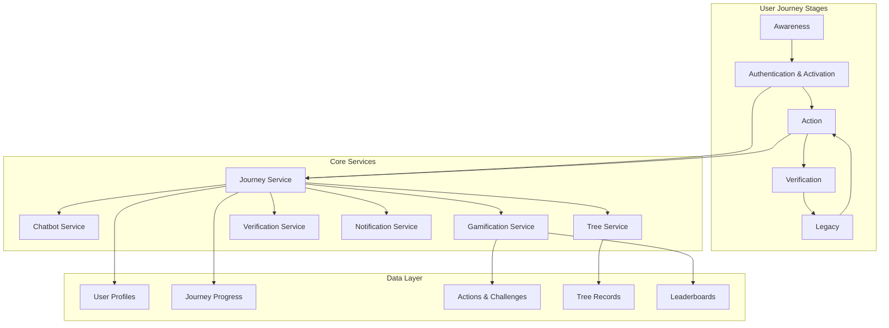
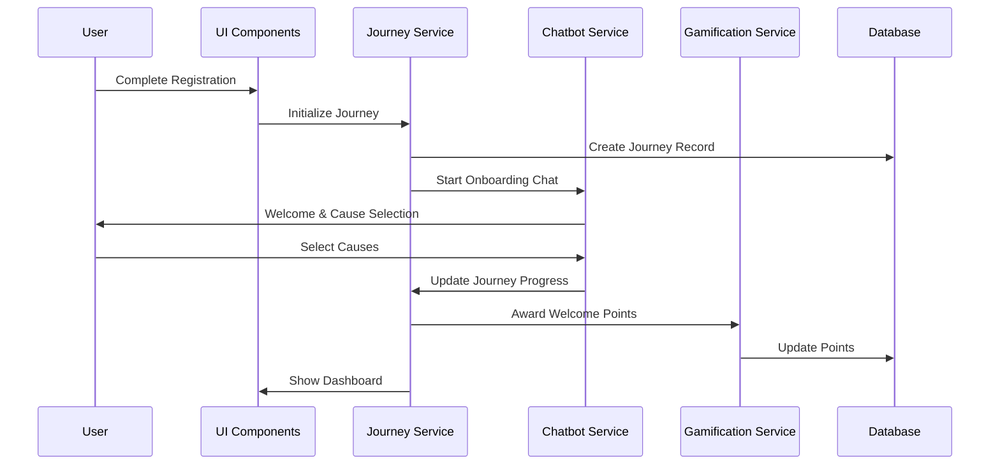

# Design Document: Individual User Journey

## Overview

The Individual User Journey feature provides a comprehensive, guided experience for citizens, students, and volunteers engaging with the Gang Green platform. The design implements a progressive engagement model that moves users through five key stages: Awareness, Authentication & Activation, Action, Verification, and Legacy. Each stage builds upon the previous one, creating a cohesive experience that maximizes user engagement and environmental impact.

The system integrates with existing platform features including the AI chatbot, gamification system, tree registry, initiative management, and verification services. The design emphasizes seamless transitions between stages, personalized content delivery, and continuous feedback loops that keep users engaged throughout their journey.

## Architecture

### High-Level Architecture



### Service Layer Architecture

The Individual User Journey is orchestrated by a central Journey Service that coordinates with existing platform services:

1. **Journey Service**: Manages user progression through stages, tracks milestones, and triggers stage-specific actions
2. **Chatbot Service**: Provides AI-guided onboarding and cause selection
3. **Gamification Service**: Awards points, badges, and manages challenges
4. **Tree Service**: Handles tree planting records and monitoring
5. **Verification Service**: Validates user actions using AI and satellite data
6. **Notification Service**: Delivers timely updates and reminders

### Data Flow



## Components and Interfaces

### 1. Journey Orchestration Components

#### JourneyProvider (Context)
```typescript
interface JourneyContextValue {
  currentStage: JourneyStage;
  progress: JourneyProgress;
  nextMilestone: Milestone | null;
  advanceStage: (stage: JourneyStage) => Promise<void>;
  trackAction: (action: UserAction) => Promise<void>;
  getRecommendations: () => Promise<Recommendation[]>;
}

enum JourneyStage {
  AWARENESS = 'awareness',
  ACTIVATION = 'activation',
  ACTION = 'action',
  VERIFICATION = 'verification',
  LEGACY = 'legacy'
}

interface JourneyProgress {
  userId: string;
  currentStage: JourneyStage;
  stageProgress: Record<JourneyStage, number>; // 0-100
  completedMilestones: string[];
  joinedCauses: string[];
  totalPoints: number;
  treesPlanted: number;
  challengesCompleted: number;
  referralCount: number;
  createdAt: Date;
  updatedAt: Date;
}
```

#### JourneyDashboard Component
- Displays current stage and progress
- Shows next recommended actions
- Highlights recent achievements
- Provides quick access to active challenges and trees

#### StageIndicator Component
- Visual representation of journey stages
- Progress bar for current stage
- Milestone markers
- Celebration animations for stage completion

### 2. Awareness Stage Components

#### LandingPage Component
- Hero section with local environmental stories
- Social proof (user count, trees planted, impact metrics)
- Call-to-action for registration
- Referral source tracking

#### StoryCarousel Component
- Rotating display of local conservation stories
- Images and videos from Northern Kenya and other regions
- Share buttons for social media
- "Get Involved" CTAs

### 3. Authentication & Activation Components

#### OnboardingFlow Component
```typescript
interface OnboardingFlowProps {
  onComplete: (profile: UserProfile) => void;
}

interface OnboardingStep {
  id: string;
  title: string;
  component: React.ComponentType;
  isComplete: boolean;
}
```

Steps:
1. Welcome & Platform Introduction
2. AI Chatbot Cause Selection
3. Profile Customization
4. Community Selection
5. First Climate Nugget

#### CauseSelectionWizard Component
- Integrates with AI Chatbot
- Displays cause categories (trees, waste, water, petitions, philanthropy)
- Shows relevant initiatives for each cause
- Multi-select capability
- Personalized recommendations based on location and interests

#### ClimateNuggetCard Component
```typescript
interface ClimateNugget {
  id: string;
  title: string;
  content: string;
  category: string;
  imageUrl?: string;
  readTime: number;
  relatedCauses: string[];
  createdAt: Date;
}
```

### 4. Action Stage Components

#### MicroChallengeHub Component
```typescript
interface MicroChallenge {
  id: string;
  title: string;
  description: string;
  difficulty: 'easy' | 'medium' | 'hard';
  points: number;
  category: string;
  requirements: ChallengeRequirement[];
  timeLimit?: number; // minutes
  participantCount: number;
  completionRate: number;
}

interface ChallengeRequirement {
  type: 'tree_plant' | 'photo_upload' | 'location_visit' | 'quiz' | 'share';
  description: string;
  isComplete: boolean;
}
```

Features:
- Challenge list with filters (difficulty, category, time)
- Active challenges tracker
- Progress indicators
- Completion submission flow

#### TreePlantingFlow Component
```typescript
interface TreePlantingRecord {
  id: string;
  userId: string;
  species: string;
  location: {
    latitude: number;
    longitude: number;
    forestName: string;
  };
  photos: string[];
  plantedAt: Date;
  verificationStatus: 'pending' | 'verified' | 'rejected';
  aiAnalysis?: AIAnalysisResult;
  survivalChecks: SurvivalCheck[];
}
```

Steps:
1. Location capture (GPS or manual selection)
2. Species selection
3. Photo capture/upload
4. Additional details (optional)
5. Submission and confirmation

#### CommunityFeed Component
- Activity stream from joined communities
- Member highlights and achievements
- Community challenges and events
- Discussion threads
- Follow/unfollow functionality

### 5. Verification Stage Components

#### VerificationDashboard Component
```typescript
interface VerificationStatus {
  treeId: string;
  status: 'pending' | 'in_progress' | 'verified' | 'rejected';
  aiVerification?: {
    treeDetected: boolean;
    confidence: number;
    species: string;
    healthScore: number;
  };
  satelliteVerification?: {
    locationConfirmed: boolean;
    vegetationIndex: number;
    lastChecked: Date;
  };
  manualReview?: {
    reviewedBy: string;
    reviewedAt: Date;
    notes: string;
  };
}
```

Features:
- List of all user actions pending verification
- Real-time status updates
- Detailed verification results
- Resubmission option for rejected items

#### AIVerificationIndicator Component
- Visual representation of AI analysis
- Confidence scores
- Detected features (tree, species, health)
- Explanation of verification criteria

### 6. Legacy Stage Components

#### LeaderboardView Component
```typescript
interface LeaderboardEntry {
  rank: number;
  userId: string;
  username: string;
  avatarUrl?: string;
  score: number;
  treesPlanted: number;
  carbonSequestered: number;
  badges: Badge[];
  trend: 'up' | 'down' | 'stable';
}

interface LeaderboardFilter {
  metric: 'points' | 'trees' | 'carbon' | 'referrals';
  period: 'weekly' | 'monthly' | 'all_time';
  community?: string;
}
```

Features:
- Multiple leaderboard types
- Time period filters
- User's current position
- Nearby competitors
- Achievement highlights

#### ImpactDashboard Component
```typescript
interface UserImpact {
  totalTrees: number;
  carbonSequestered: number; // kg
  areaRestored: number; // hectares
  waterConserved: number; // liters
  wasteRecycled: number; // kg
  communitiesJoined: number;
  challengesCompleted: number;
  referralsActive: number;
  impactTrend: ImpactTrendData[];
}
```

Visualizations:
- Impact metrics cards
- Growth charts over time
- Comparison to community averages
- Milestone timeline
- Environmental equivalents (e.g., "Equal to X cars off the road")

#### ReferralCenter Component
```typescript
interface ReferralData {
  referralCode: string;
  referralLink: string;
  totalReferrals: number;
  activeReferrals: number;
  pointsEarned: number;
  milestones: ReferralMilestone[];
}

interface ReferralMilestone {
  threshold: number;
  reward: {
    points: number;
    badge?: Badge;
  };
  achieved: boolean;
}
```

Features:
- Unique referral link generation
- Social sharing buttons
- Referral statistics
- Reward tracking
- Shareable graphics

#### PetitionHub Component
```typescript
interface Petition {
  id: string;
  title: string;
  description: string;
  category: string;
  targetSignatures: number;
  currentSignatures: number;
  createdBy: string;
  createdAt: Date;
  expiresAt?: Date;
  status: 'active' | 'successful' | 'expired';
  updates: PetitionUpdate[];
}
```

Features:
- Create petition form
- Active petitions list
- Petition details and progress
- Signature submission
- Share functionality
- Update notifications

#### CertificationGallery Component
```typescript
interface Certificate {
  id: string;
  type: 'hero_badge' | 'milestone' | 'achievement';
  title: string;
  description: string;
  earnedAt: Date;
  imageUrl: string;
  pdfUrl: string;
  shareableUrl: string;
  metadata: {
    treesPlanted?: number;
    pointsEarned?: number;
    challengesCompleted?: number;
  };
}
```

Features:
- Grid view of all certificates
- Certificate details modal
- Download as PDF
- Share to social media and LinkedIn
- Print-friendly format

### 7. Notification Components

#### NotificationCenter Component
```typescript
interface Notification {
  id: string;
  type: 'achievement' | 'reminder' | 'update' | 'social' | 'system';
  title: string;
  message: string;
  actionUrl?: string;
  actionLabel?: string;
  isRead: boolean;
  createdAt: Date;
  priority: 'low' | 'medium' | 'high';
}
```

Features:
- Notification list with filters
- Mark as read/unread
- Bulk actions
- Notification preferences
- Real-time updates

#### SurvivalReminderSystem
- Scheduled reminders at 30, 60, 90 days
- Tree-specific reminders
- Photo upload prompts
- Progress update notifications

## Data Models

### Journey Progress Table
```sql
CREATE TABLE user_journey_progress (
  id UUID PRIMARY KEY DEFAULT uuid_generate_v4(),
  user_id UUID REFERENCES users(id) NOT NULL,
  current_stage VARCHAR(50) NOT NULL,
  stage_progress JSONB NOT NULL DEFAULT '{}',
  completed_milestones TEXT[] DEFAULT '{}',
  joined_causes TEXT[] DEFAULT '{}',
  total_points INTEGER DEFAULT 0,
  trees_planted INTEGER DEFAULT 0,
  challenges_completed INTEGER DEFAULT 0,
  referral_count INTEGER DEFAULT 0,
  created_at TIMESTAMP WITH TIME ZONE DEFAULT NOW(),
  updated_at TIMESTAMP WITH TIME ZONE DEFAULT NOW(),
  UNIQUE(user_id)
);

CREATE INDEX idx_journey_stage ON user_journey_progress(current_stage);
CREATE INDEX idx_journey_user ON user_journey_progress(user_id);
```

### Micro Challenges Table
```sql
CREATE TABLE micro_challenges (
  id UUID PRIMARY KEY DEFAULT uuid_generate_v4(),
  title VARCHAR(255) NOT NULL,
  description TEXT NOT NULL,
  difficulty VARCHAR(20) NOT NULL CHECK (difficulty IN ('easy', 'medium', 'hard')),
  points INTEGER NOT NULL,
  category VARCHAR(100) NOT NULL,
  requirements JSONB NOT NULL,
  time_limit INTEGER, -- minutes
  is_active BOOLEAN DEFAULT true,
  participant_count INTEGER DEFAULT 0,
  completion_count INTEGER DEFAULT 0,
  created_at TIMESTAMP WITH TIME ZONE DEFAULT NOW(),
  updated_at TIMESTAMP WITH TIME ZONE DEFAULT NOW()
);

CREATE TABLE user_challenge_progress (
  id UUID PRIMARY KEY DEFAULT uuid_generate_v4(),
  user_id UUID REFERENCES users(id) NOT NULL,
  challenge_id UUID REFERENCES micro_challenges(id) NOT NULL,
  status VARCHAR(50) NOT NULL DEFAULT 'active',
  progress JSONB NOT NULL DEFAULT '{}',
  started_at TIMESTAMP WITH TIME ZONE DEFAULT NOW(),
  completed_at TIMESTAMP WITH TIME ZONE,
  UNIQUE(user_id, challenge_id)
);
```

### Climate Nuggets Table
```sql
CREATE TABLE climate_nuggets (
  id UUID PRIMARY KEY DEFAULT uuid_generate_v4(),
  title VARCHAR(255) NOT NULL,
  content TEXT NOT NULL,
  category VARCHAR(100) NOT NULL,
  image_url TEXT,
  read_time INTEGER NOT NULL, -- minutes
  related_causes TEXT[] DEFAULT '{}',
  is_published BOOLEAN DEFAULT true,
  created_at TIMESTAMP WITH TIME ZONE DEFAULT NOW(),
  updated_at TIMESTAMP WITH TIME ZONE DEFAULT NOW()
);

CREATE TABLE user_climate_nuggets (
  id UUID PRIMARY KEY DEFAULT uuid_generate_v4(),
  user_id UUID REFERENCES users(id) NOT NULL,
  nugget_id UUID REFERENCES climate_nuggets(id) NOT NULL,
  is_read BOOLEAN DEFAULT false,
  read_at TIMESTAMP WITH TIME ZONE,
  is_saved BOOLEAN DEFAULT false,
  created_at TIMESTAMP WITH TIME ZONE DEFAULT NOW(),
  UNIQUE(user_id, nugget_id)
);
```

### Referrals Table
```sql
CREATE TABLE user_referrals (
  id UUID PRIMARY KEY DEFAULT uuid_generate_v4(),
  referrer_id UUID REFERENCES users(id) NOT NULL,
  referred_id UUID REFERENCES users(id) NOT NULL,
  referral_code VARCHAR(50) NOT NULL,
  status VARCHAR(50) NOT NULL DEFAULT 'pending',
  points_awarded INTEGER DEFAULT 0,
  created_at TIMESTAMP WITH TIME ZONE DEFAULT NOW(),
  activated_at TIMESTAMP WITH TIME ZONE,
  UNIQUE(referred_id)
);

CREATE INDEX idx_referrals_referrer ON user_referrals(referrer_id);
CREATE INDEX idx_referrals_code ON user_referrals(referral_code);
```

### Petitions Table
```sql
CREATE TABLE petitions (
  id UUID PRIMARY KEY DEFAULT uuid_generate_v4(),
  title VARCHAR(255) NOT NULL,
  description TEXT NOT NULL,
  category VARCHAR(100) NOT NULL,
  target_signatures INTEGER NOT NULL,
  current_signatures INTEGER DEFAULT 0,
  created_by UUID REFERENCES users(id) NOT NULL,
  status VARCHAR(50) NOT NULL DEFAULT 'active',
  created_at TIMESTAMP WITH TIME ZONE DEFAULT NOW(),
  expires_at TIMESTAMP WITH TIME ZONE,
  updated_at TIMESTAMP WITH TIME ZONE DEFAULT NOW()
);

CREATE TABLE petition_signatures (
  id UUID PRIMARY KEY DEFAULT uuid_generate_v4(),
  petition_id UUID REFERENCES petitions(id) NOT NULL,
  user_id UUID REFERENCES users(id) NOT NULL,
  signed_at TIMESTAMP WITH TIME ZONE DEFAULT NOW(),
  UNIQUE(petition_id, user_id)
);
```

### Certificates Table
```sql
CREATE TABLE user_certificates (
  id UUID PRIMARY KEY DEFAULT uuid_generate_v4(),
  user_id UUID REFERENCES users(id) NOT NULL,
  type VARCHAR(50) NOT NULL,
  title VARCHAR(255) NOT NULL,
  description TEXT NOT NULL,
  image_url TEXT NOT NULL,
  pdf_url TEXT NOT NULL,
  shareable_url TEXT NOT NULL,
  metadata JSONB DEFAULT '{}',
  earned_at TIMESTAMP WITH TIME ZONE DEFAULT NOW()
);

CREATE INDEX idx_certificates_user ON user_certificates(user_id);
CREATE INDEX idx_certificates_type ON user_certificates(type);
```

## Error Handling

### Journey Stage Transitions
- Validate prerequisites before allowing stage advancement
- Handle concurrent updates to journey progress
- Rollback on transaction failures
- Log all stage transitions for analytics

### Verification Failures
- Provide clear feedback on why verification failed
- Allow resubmission with guidance
- Escalate to manual review after multiple AI failures
- Notify users of verification status changes

### Challenge Completion
- Validate all requirements before marking complete
- Handle partial completions gracefully
- Prevent duplicate submissions
- Award points atomically with completion

### Notification Delivery
- Retry failed notifications up to 3 times
- Queue notifications during system maintenance
- Respect user notification preferences
- Track delivery status for analytics

## Testing Strategy

### Unit Tests
- Journey service stage transitions
- Points calculation logic
- Verification status updates
- Notification scheduling
- Referral code generation

### Integration Tests
- Complete onboarding flow
- Tree planting with verification
- Challenge completion and rewards
- Leaderboard updates
- Petition creation and signing

### End-to-End Tests
- New user registration through first tree plant
- Complete micro-challenge flow
- Referral link sharing and activation
- Certificate generation and download
- Multi-stage journey progression

### Performance Tests
- Leaderboard query performance with 100k+ users
- Real-time notification delivery
- Concurrent challenge submissions
- Journey progress updates under load

### User Acceptance Tests
- Onboarding flow usability
- Chatbot cause selection effectiveness
- Challenge discovery and completion
- Impact dashboard comprehension
- Certificate sharing functionality

## Security Considerations

### Data Privacy
- Encrypt sensitive user data at rest
- Anonymize leaderboard data for privacy
- Allow users to opt out of public profiles
- Secure referral codes against enumeration

### Action Verification
- Prevent GPS spoofing for tree planting
- Validate photo metadata integrity
- Rate limit challenge submissions
- Detect and prevent point farming

### Petition Integrity
- Prevent duplicate signatures
- Validate user authentication for signatures
- Rate limit petition creation
- Moderate petition content

## Performance Optimization

### Caching Strategy
- Cache leaderboard data (5-minute TTL)
- Cache user journey progress (1-minute TTL)
- Cache climate nuggets (1-hour TTL)
- Cache challenge lists (10-minute TTL)

### Database Optimization
- Index frequently queried fields
- Partition large tables by date
- Use materialized views for leaderboards
- Implement read replicas for analytics

### Real-time Updates
- Use Supabase real-time for notifications
- WebSocket connections for live leaderboards
- Optimistic UI updates for better UX
- Batch notification delivery

## Accessibility

- WCAG 2.1 AA compliance for all components
- Keyboard navigation for all interactive elements
- Screen reader support with ARIA labels
- High contrast mode support
- Responsive design for mobile devices
- Offline capability for tree planting

## Analytics and Monitoring

### Key Metrics
- Journey stage completion rates
- Average time in each stage
- Challenge completion rates
- Verification success rates
- Referral conversion rates
- Notification engagement rates

### User Behavior Tracking
- Onboarding drop-off points
- Most popular causes and challenges
- Leaderboard engagement
- Certificate sharing rates
- Petition participation

### System Health
- API response times
- Verification processing times
- Notification delivery rates
- Database query performance
- Error rates by component
