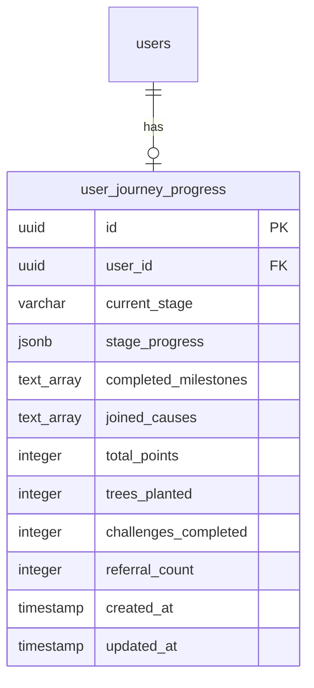

# Design Document: Journey Database Fix

## Overview

This design addresses the missing database infrastructure for the Individual User Journey feature. The journey service code exists and is functional, but attempts to query a `user_journey_progress` table that was never created. This causes 404 errors when users interact with journey features. The solution is to create a database migration that establishes the required table structure with appropriate indexes, constraints, and Row Level Security (RLS) policies.

## Architecture

### Database Schema

The journey tracking system requires a single primary table to store user progress:



### Integration Points

The journey database integrates with existing platform components:

1. **Journey Service** (`src/services/journey.service.ts`) - Already implemented, waiting for database
2. **Journey Context** (`src/contexts/JourneyContext.tsx`) - Provides journey state to React components
3. **Auth System** - Links journey records to authenticated users
4. **Gamification System** - Updates points and achievements based on journey progress

## Components and Interfaces

### Database Table Structure

```sql
CREATE TABLE user_journey_progress (
  id UUID PRIMARY KEY DEFAULT uuid_generate_v4(),
  user_id UUID REFERENCES users(id) ON DELETE CASCADE NOT NULL,
  current_stage VARCHAR(50) NOT NULL DEFAULT 'awareness',
  stage_progress JSONB NOT NULL DEFAULT '{"awareness": 0, "activation": 0, "action": 0, "verification": 0, "legacy": 0}',
  completed_milestones TEXT[] DEFAULT '{}',
  joined_causes TEXT[] DEFAULT '{}',
  total_points INTEGER DEFAULT 0,
  trees_planted INTEGER DEFAULT 0,
  challenges_completed INTEGER DEFAULT 0,
  referral_count INTEGER DEFAULT 0,
  created_at TIMESTAMP WITH TIME ZONE DEFAULT NOW(),
  updated_at TIMESTAMP WITH TIME ZONE DEFAULT NOW(),
  CONSTRAINT unique_user_journey UNIQUE(user_id),
  CONSTRAINT valid_stage CHECK (current_stage IN ('awareness', 'activation', 'action', 'verification', 'legacy'))
);
```

### Indexes

```sql
-- Primary lookup by user
CREATE INDEX idx_journey_user_id ON user_journey_progress(user_id);

-- Analytics queries by stage
CREATE INDEX idx_journey_current_stage ON user_journey_progress(current_stage);

-- Composite index for stage-based user queries
CREATE INDEX idx_journey_user_stage ON user_journey_progress(user_id, current_stage);
```

### Row Level Security Policies

```sql
-- Enable RLS
ALTER TABLE user_journey_progress ENABLE ROW LEVEL SECURITY;

-- Users can read their own journey progress
CREATE POLICY "Users can view own journey progress"
  ON user_journey_progress
  FOR SELECT
  USING (auth.uid() = user_id);

-- Users can update their own journey progress
CREATE POLICY "Users can update own journey progress"
  ON user_journey_progress
  FOR UPDATE
  USING (auth.uid() = user_id);

-- Users can insert their own journey progress
CREATE POLICY "Users can insert own journey progress"
  ON user_journey_progress
  FOR INSERT
  WITH CHECK (auth.uid() = user_id);

-- Service role can bypass RLS for system operations
CREATE POLICY "Service role has full access"
  ON user_journey_progress
  FOR ALL
  USING (auth.jwt()->>'role' = 'service_role');
```

### Automatic Timestamp Updates

```sql
-- Function to update updated_at timestamp
CREATE OR REPLACE FUNCTION update_journey_updated_at()
RETURNS TRIGGER AS $$
BEGIN
  NEW.updated_at = NOW();
  RETURN NEW;
END;
$$ LANGUAGE plpgsql;

-- Trigger to call the function
CREATE TRIGGER journey_updated_at_trigger
  BEFORE UPDATE ON user_journey_progress
  FOR EACH ROW
  EXECUTE FUNCTION update_journey_updated_at();
```

## Data Models

### Journey Progress Record

The `user_journey_progress` table stores the following data:

| Column | Type | Description | Default |
|--------|------|-------------|---------|
| id | UUID | Primary key | uuid_generate_v4() |
| user_id | UUID | Foreign key to users table | Required |
| current_stage | VARCHAR(50) | Current journey stage | 'awareness' |
| stage_progress | JSONB | Progress percentage for each stage (0-100) | All stages at 0 |
| completed_milestones | TEXT[] | Array of completed milestone IDs | Empty array |
| joined_causes | TEXT[] | Array of cause IDs user has joined | Empty array |
| total_points | INTEGER | Total points earned | 0 |
| trees_planted | INTEGER | Number of trees planted | 0 |
| challenges_completed | INTEGER | Number of challenges completed | 0 |
| referral_count | INTEGER | Number of successful referrals | 0 |
| created_at | TIMESTAMP | Record creation time | NOW() |
| updated_at | TIMESTAMP | Last update time | NOW() |

### Stage Progress JSONB Structure

```json
{
  "awareness": 0,
  "activation": 25,
  "action": 50,
  "verification": 0,
  "legacy": 0
}
```

Each stage has a progress value from 0-100, representing percentage completion.

## Correctness Properties

*A property is a characteristic or behavior that should hold true across all valid executions of a system-essentially, a formal statement about what the system should do. Properties serve as the bridge between human-readable specifications and machine-verifiable correctness guarantees.*

### Property 1: User Journey Uniqueness
*For any* user in the system, there should be at most one journey progress record associated with that user_id.
**Validates: Requirements 1.2**

### Property 2: Journey Data Isolation
*For any* authenticated user, querying journey progress should only return records where the user_id matches the authenticated user's ID.
**Validates: Requirements 2.1, 2.4**

### Property 3: Stage Value Validity
*For any* journey progress record, the current_stage value should be one of the five valid stages: 'awareness', 'activation', 'action', 'verification', or 'legacy'.
**Validates: Requirements 1.1**

### Property 4: Default Value Initialization
*For any* newly created journey progress record, all numeric fields (total_points, trees_planted, challenges_completed, referral_count) should be initialized to 0, and all array fields should be initialized to empty arrays.
**Validates: Requirements 1.5**

### Property 5: Timestamp Consistency
*For any* journey progress record, the updated_at timestamp should be greater than or equal to the created_at timestamp.
**Validates: Requirements 1.6**

### Property 6: Update Timestamp Automation
*For any* update operation on a journey progress record, the updated_at timestamp should be automatically set to the current time.
**Validates: Requirements 1.6**

## Error Handling

### Migration Errors

**Duplicate Table**: If the table already exists, the migration should fail gracefully with a clear error message. The deployment script should check for table existence before attempting creation.

**Foreign Key Violations**: If the users table doesn't exist or the foreign key constraint fails, the migration should roll back completely.

**Index Creation Failures**: If indexes fail to create, the migration should continue but log warnings, as indexes are performance optimizations rather than functional requirements.

### Runtime Errors

**Unique Constraint Violations**: When attempting to insert a duplicate journey record for a user, the journey service should catch the error (code 23505) and fetch the existing record instead.

**RLS Policy Violations**: When a user attempts to access another user's journey data, the database should return an empty result set rather than an error, maintaining security without exposing information.

**Invalid Stage Values**: The CHECK constraint will prevent invalid stage values at the database level, returning a constraint violation error that the service should handle gracefully.

## Testing Strategy

### Unit Tests

Since this is a database migration, traditional unit tests don't apply. Instead, we'll use migration validation tests:

1. **Table Creation Test**: Verify the table exists after migration
2. **Column Validation Test**: Verify all columns exist with correct types
3. **Constraint Test**: Verify unique constraint on user_id
4. **Index Test**: Verify all indexes are created
5. **RLS Policy Test**: Verify policies are enabled and configured

### Integration Tests

1. **Journey Service Integration**: Test that the journey service can successfully create, read, and update journey records
2. **RLS Enforcement**: Test that users can only access their own journey data
3. **Cascade Delete**: Test that deleting a user also deletes their journey progress
4. **Concurrent Updates**: Test that multiple simultaneous updates to the same journey record are handled correctly

### Example Tests

```typescript
// Integration test example
describe('Journey Progress Database', () => {
  it('should create journey progress for new user', async () => {
    const userId = 'test-user-id';
    const result = await journeyService.initializeJourney(userId);
    
    expect(result.error).toBeNull();
    expect(result.data).toBeDefined();
    expect(result.data?.userId).toBe(userId);
    expect(result.data?.currentStage).toBe('awareness');
  });

  it('should enforce unique constraint per user', async () => {
    const userId = 'test-user-id';
    await journeyService.initializeJourney(userId);
    
    // Second attempt should return existing record, not create duplicate
    const result = await journeyService.initializeJourney(userId);
    expect(result.error).toBeNull();
    expect(result.data).toBeDefined();
  });

  it('should enforce RLS policies', async () => {
    const user1Id = 'user-1';
    const user2Id = 'user-2';
    
    // Create journey for user 1
    await journeyService.initializeJourney(user1Id);
    
    // Attempt to access user 1's journey as user 2 should fail
    // (This would require mocking auth context)
    const result = await supabase
      .from('user_journey_progress')
      .select('*')
      .eq('user_id', user1Id)
      .single();
    
    expect(result.data).toBeNull(); // RLS should prevent access
  });
});
```

## Security Considerations

### Data Privacy

- **User Isolation**: RLS policies ensure users can only access their own journey data
- **Service Role Access**: Only the service role can perform administrative operations
- **No Public Access**: The table has no public read/write policies

### Data Integrity

- **Foreign Key Constraint**: Ensures journey records are always linked to valid users
- **Cascade Delete**: Automatically removes journey data when a user is deleted
- **Unique Constraint**: Prevents duplicate journey records per user
- **Check Constraint**: Ensures only valid stage values are stored

### Audit Trail

- **Timestamps**: created_at and updated_at provide audit trail
- **Immutable History**: Consider adding a journey_history table in future for tracking stage transitions

## Performance Optimization

### Indexing Strategy

1. **Primary Index** (user_id): Optimizes the most common query pattern (fetch by user)
2. **Stage Index** (current_stage): Enables efficient analytics queries (e.g., "how many users in each stage?")
3. **Composite Index** (user_id, current_stage): Optimizes filtered user queries

### Query Optimization

- **Single Record Queries**: Most queries fetch a single record by user_id, which is highly efficient with the index
- **JSONB Indexing**: Consider adding GIN index on stage_progress if complex JSONB queries are needed in future
- **Materialized Views**: For analytics dashboards showing stage distribution, consider materialized views

### Caching Strategy

The journey service already implements caching:
- 1-minute TTL for journey progress data
- Cache invalidation on updates
- This reduces database load for frequently accessed journey data

## Deployment Plan

### Migration File

Create migration file: `supabase/migrations/025_create_journey_progress_table.sql`

### Deployment Steps

1. **Test Locally**: Apply migration to local Supabase instance
2. **Verify Structure**: Query table structure to confirm all columns and constraints
3. **Test RLS**: Verify policies work correctly with test users
4. **Deploy to Staging**: Apply migration to staging environment
5. **Smoke Test**: Test journey feature end-to-end in staging
6. **Deploy to Production**: Apply migration to production database
7. **Monitor**: Watch for errors in production logs

### Rollback Plan

```sql
-- Rollback script
DROP TRIGGER IF EXISTS journey_updated_at_trigger ON user_journey_progress;
DROP FUNCTION IF EXISTS update_journey_updated_at();
DROP TABLE IF EXISTS user_journey_progress CASCADE;
```

### Verification Queries

```sql
-- Verify table exists
SELECT table_name FROM information_schema.tables 
WHERE table_schema = 'public' AND table_name = 'user_journey_progress';

-- Verify columns
SELECT column_name, data_type, column_default 
FROM information_schema.columns 
WHERE table_name = 'user_journey_progress';

-- Verify indexes
SELECT indexname, indexdef 
FROM pg_indexes 
WHERE tablename = 'user_journey_progress';

-- Verify RLS is enabled
SELECT tablename, rowsecurity 
FROM pg_tables 
WHERE tablename = 'user_journey_progress';

-- Verify policies
SELECT policyname, cmd, qual 
FROM pg_policies 
WHERE tablename = 'user_journey_progress';
```

## Monitoring and Observability

### Key Metrics

- **Journey Creation Rate**: Number of new journey records created per day
- **Stage Distribution**: Count of users in each journey stage
- **Update Frequency**: Average number of updates per journey record
- **Query Performance**: Average query time for journey lookups

### Alerts

- **Migration Failure**: Alert if migration fails during deployment
- **RLS Violations**: Alert if RLS policy violations are detected
- **Slow Queries**: Alert if journey queries exceed 500ms
- **Constraint Violations**: Alert if unique or check constraints are violated

## Future Enhancements

### Journey History Tracking

Consider adding a `user_journey_history` table to track stage transitions:

```sql
CREATE TABLE user_journey_history (
  id UUID PRIMARY KEY DEFAULT uuid_generate_v4(),
  user_id UUID REFERENCES users(id) ON DELETE CASCADE,
  from_stage VARCHAR(50),
  to_stage VARCHAR(50),
  transitioned_at TIMESTAMP WITH TIME ZONE DEFAULT NOW()
);
```

### Analytics Views

Create materialized views for common analytics queries:

```sql
CREATE MATERIALIZED VIEW journey_stage_distribution AS
SELECT 
  current_stage,
  COUNT(*) as user_count,
  AVG(total_points) as avg_points,
  AVG(trees_planted) as avg_trees
FROM user_journey_progress
GROUP BY current_stage;
```

### Performance Monitoring

Add query performance tracking using pg_stat_statements extension to identify slow queries and optimize indexes.
