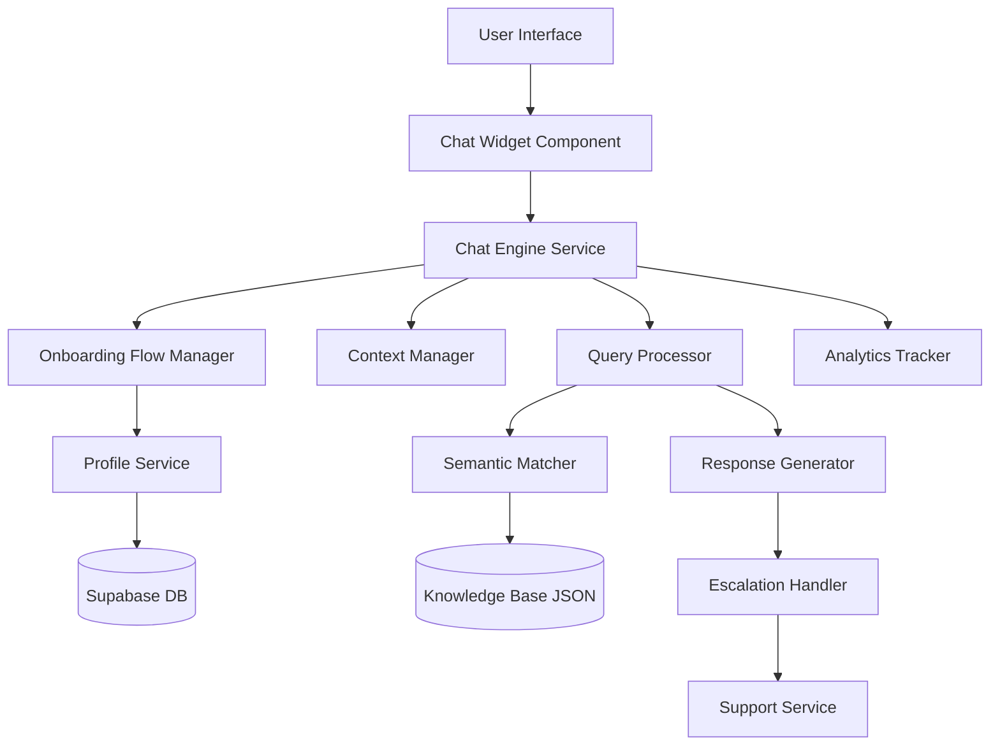
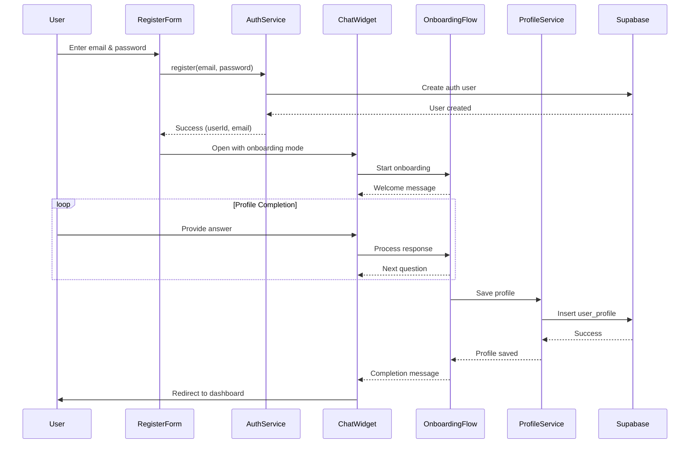

# Design Document

## Overview

The Gang Green Onboarding Chatbot is a React-based conversational interface that provides intelligent, context-aware responses to user queries about the platform and guides new users through post-registration profile completion. The chatbot leverages a JSON knowledge base, semantic matching algorithms, conversation context management, and a structured onboarding flow to deliver a seamless user experience. The design prioritizes fast response times (<500ms), maintainability, easy content updates, and a friendly conversational onboarding experience that collects user profile information after simplified email/password registration.

## Architecture

### High-Level Architecture



### Component Layers

1. **Presentation Layer**: React components for chat UI
2. **Onboarding Layer**: Post-registration profile completion flow
3. **Service Layer**: Business logic for query processing and response generation
4. **Data Layer**: JSON knowledge base and conversation state management
5. **Integration Layer**: Support ticketing, profile management, and analytics

## Components and Interfaces

### 0. Onboarding Flow Manager

**Location**: `src/services/chatbot/onboardingFlowManager.ts`

**Responsibilities**:
- Manage post-registration onboarding conversation flow
- Collect user profile information step-by-step
- Validate user inputs for each profile field
- Save completed profile data to Supabase
- Handle skip/retry logic for optional fields

**Interface**:
```typescript
interface OnboardingFlowManager {
  startOnboarding(userId: string, email: string): OnboardingSession;
  processOnboardingResponse(sessionId: string, response: string): OnboardingStepResult;
  skipCurrentStep(sessionId: string): OnboardingStepResult;
  completeOnboarding(sessionId: string): Promise<ProfileCompletionResult>;
  getOnboardingProgress(sessionId: string): OnboardingProgress;
}

interface OnboardingSession {
  sessionId: string;
  userId: string;
  email: string;
  currentStep: OnboardingStep;
  collectedData: Partial<UserProfile>;
  startedAt: Date;
}

type OnboardingStep = 
  | 'welcome'
  | 'full_name'
  | 'role'
  | 'forest_preference'
  | 'phone'
  | 'location'
  | 'organization'
  | 'complete';

interface OnboardingStepResult {
  message: string;
  nextStep: OnboardingStep;
  isValid: boolean;
  validationError?: string;
  progress: number; // 0-100
}

interface ProfileCompletionResult {
  success: boolean;
  profile?: UserProfile;
  error?: string;
}

interface OnboardingProgress {
  currentStep: OnboardingStep;
  totalSteps: number;
  completedSteps: number;
  percentComplete: number;
}
```

**Onboarding Flow Sequence**:
1. **Welcome**: Greet user and explain profile completion
2. **Full Name**: "What's your full name?"
3. **Role**: "Are you joining as an individual, community member, or organization?"
4. **Forest Preference**: "Which forest would you like to focus on? (Kakamega, Karura, or Mau)"
5. **Phone** (optional): "What's your phone number? (You can skip this)"
6. **Location** (optional): "Where are you located?"
7. **Organization** (conditional): "What's your organization name?" (only if role is 'organization')
8. **Complete**: Save profile and show welcome message

### 1. Chat Widget Component

**Location**: `src/components/chatbot/ChatWidget.tsx`

**Responsibilities**:
- Render chat interface with message history
- Handle user input and message submission
- Display typing indicators and loading states
- Provide minimize/maximize functionality
- Show quick action buttons for common queries

**Props Interface**:
```typescript
interface ChatWidgetProps {
  isOpen: boolean;
  onToggle: () => void;
  initialMessage?: string;
  position?: 'bottom-right' | 'bottom-left';
  autoStartOnboarding?: boolean;
  userId?: string;
  userEmail?: string;
}
```

**State**:
```typescript
interface ChatWidgetState {
  messages: Message[];
  isTyping: boolean;
  inputValue: string;
  isMinimized: boolean;
}
```

### 2. Message Component

**Location**: `src/components/chatbot/Message.tsx`

**Responsibilities**:
- Render individual messages (user or bot)
- Support markdown formatting in bot responses
- Display timestamps
- Show message status (sent, delivered, error)

**Props Interface**:
```typescript
interface MessageProps {
  message: Message;
  isUser: boolean;
  timestamp: Date;
}

interface Message {
  id: string;
  text: string;
  sender: 'user' | 'bot';
  timestamp: Date;
  metadata?: {
    confidence?: number;
    matchedQuestion?: string;
    escalated?: boolean;
  };
}
```

### 3. Quick Actions Component

**Location**: `src/components/chatbot/QuickActions.tsx`

**Responsibilities**:
- Display suggested questions/actions
- Handle quick action button clicks
- Update based on conversation context

**Props Interface**:
```typescript
interface QuickActionsProps {
  actions: QuickAction[];
  onActionClick: (action: QuickAction) => void;
}

interface QuickAction {
  id: string;
  label: string;
  query: string;
  category: 'getting-started' | 'projects' | 'support' | 'education';
}
```

### 4. Chat Engine Service

**Location**: `src/services/chatbot.service.ts`

**Responsibilities**:
- Orchestrate query processing pipeline
- Manage conversation state
- Coordinate between components
- Handle error scenarios

**Interface**:
```typescript
interface ChatEngineService {
  processQuery(query: string, conversationId: string): Promise<ChatResponse>;
  processOnboardingResponse(response: string, conversationId: string): Promise<ChatResponse>;
  initializeConversation(mode?: 'general' | 'onboarding'): string;
  startOnboarding(userId: string, email: string, conversationId: string): Promise<ChatResponse>;
  clearConversation(conversationId: string): void;
  getConversationHistory(conversationId: string): Message[];
  isOnboardingMode(conversationId: string): boolean;
}

interface ChatResponse {
  answer: string;
  confidence: number;
  matchedQuestion?: string;
  suggestedActions?: QuickAction[];
  requiresEscalation: boolean;
  onboardingProgress?: OnboardingProgress;
  isOnboardingComplete?: boolean;
}
```

### 5. Query Processor

**Location**: `src/services/queryProcessor.ts`

**Responsibilities**:
- Preprocess user queries (normalize, tokenize)
- Extract intent and entities
- Route to appropriate handler

**Interface**:
```typescript
interface QueryProcessor {
  process(query: string, context: ConversationContext): ProcessedQuery;
  extractIntent(query: string): Intent;
  normalizeQuery(query: string): string;
}

interface ProcessedQuery {
  originalQuery: string;
  normalizedQuery: string;
  intent: Intent;
  entities: Entity[];
  context: ConversationContext;
}

type Intent = 
  | 'getting-started'
  | 'find-projects'
  | 'join-project'
  | 'education'
  | 'community'
  | 'verification'
  | 'sponsorship'
  | 'support'
  | 'unknown';

interface Entity {
  type: 'user-type' | 'project-type' | 'action' | 'location';
  value: string;
  confidence: number;
}
```

### 6. Semantic Matcher

**Location**: `src/services/semanticMatcher.ts`

**Responsibilities**:
- Match user queries to knowledge base questions
- Calculate similarity scores
- Return ranked matches

**Interface**:
```typescript
interface SemanticMatcher {
  findBestMatch(query: string, knowledgeBase: KnowledgeBaseEntry[]): MatchResult;
  calculateSimilarity(query: string, question: string): number;
  rankMatches(query: string, questions: string[]): RankedMatch[];
}

interface MatchResult {
  entry: KnowledgeBaseEntry;
  confidence: number;
  similarityScore: number;
}

interface RankedMatch {
  question: string;
  score: number;
  index: number;
}
```

**Matching Algorithm**:
- Use TF-IDF vectorization for keyword matching
- Apply cosine similarity for semantic comparison
- Implement fuzzy string matching for typo tolerance
- Weight recent conversation context (20% boost for related topics)

### 7. Context Manager

**Location**: `src/services/contextManager.ts`

**Responsibilities**:
- Maintain conversation history
- Track user journey and topics discussed
- Provide context for follow-up questions
- Implement session timeout (20 minutes)

**Interface**:
```typescript
interface ContextManager {
  addMessage(conversationId: string, message: Message): void;
  getContext(conversationId: string): ConversationContext;
  updateContext(conversationId: string, updates: Partial<ConversationContext>): void;
  clearContext(conversationId: string): void;
  isContextExpired(conversationId: string): boolean;
}

interface ConversationContext {
  conversationId: string;
  userId?: string;
  messageHistory: Message[];
  topicsDiscussed: string[];
  lastIntent: Intent;
  startTime: Date;
  lastActivityTime: Date;
  userType?: 'individual' | 'corporate' | 'partner' | 'sponsor';
}
```

### 8. Response Generator

**Location**: `src/services/responseGenerator.ts`

**Responsibilities**:
- Format responses from knowledge base
- Add personalization based on context
- Generate follow-up suggestions
- Handle multi-part responses

**Interface**:
```typescript
interface ResponseGenerator {
  generate(matchResult: MatchResult, context: ConversationContext): GeneratedResponse;
  personalize(response: string, context: ConversationContext): string;
  addFollowUps(response: GeneratedResponse, context: ConversationContext): GeneratedResponse;
}

interface GeneratedResponse {
  text: string;
  confidence: number;
  followUpActions: QuickAction[];
  relatedQuestions: string[];
  metadata: {
    sourceQuestion: string;
    personalized: boolean;
  };
}
```

### 9. Escalation Handler

**Location**: `src/services/escalationHandler.ts`

**Responsibilities**:
- Detect when escalation is needed
- Create support tickets
- Provide human support contact information
- Track escalation metrics

**Interface**:
```typescript
interface EscalationHandler {
  shouldEscalate(confidence: number, attemptCount: number): boolean;
  createSupportTicket(conversation: ConversationContext): Promise<SupportTicket>;
  getContactInfo(): ContactInfo;
  trackEscalation(conversationId: string, reason: EscalationReason): void;
}

interface SupportTicket {
  ticketId: string;
  conversationId: string;
  userId?: string;
  messageHistory: Message[];
  priority: 'low' | 'medium' | 'high';
  category: string;
  createdAt: Date;
}

type EscalationReason = 
  | 'low-confidence'
  | 'user-request'
  | 'repeated-failure'
  | 'complex-query';

interface ContactInfo {
  email: string;
  expectedResponseTime: string;
  supportHours: string;
}
```

### 10. Knowledge Base Manager

**Location**: `src/services/knowledgeBaseManager.ts`

**Responsibilities**:
- Load and parse JSON knowledge base
- Cache knowledge base in memory
- Handle hot-reload on updates
- Validate knowledge base structure

**Interface**:
```typescript
interface KnowledgeBaseManager {
  loadKnowledgeBase(): Promise<KnowledgeBaseEntry[]>;
  reloadKnowledgeBase(): Promise<void>;
  getEntry(id: string): KnowledgeBaseEntry | null;
  searchEntries(query: string): KnowledgeBaseEntry[];
  validateKnowledgeBase(data: unknown): boolean;
}

interface KnowledgeBaseEntry {
  id?: string;
  question: string;
  answer: string;
  category?: string;
  keywords?: string[];
  relatedQuestions?: string[];
}
```

## Data Models

### Knowledge Base JSON Structure

**Location**: `src/data/chatbot-knowledge-base.json`

```json
[
  {
    "question": "What is Gang Green and how can I get involved?",
    "answer": "Gang Green is a tech-powered, community-centric climate action platform...",
    "category": "getting-started",
    "keywords": ["about", "join", "get started", "involved"],
    "relatedQuestions": [
      "How do I sign up as an individual?",
      "How do I sign up a corporation or organization?"
    ]
  }
]
```

### Conversation State Storage

**Storage**: Browser localStorage for persistence across sessions

```typescript
interface StoredConversation {
  conversationId: string;
  messages: Message[];
  context: ConversationContext;
  lastUpdated: Date;
}
```

**Storage Key**: `ganggreen_chatbot_conversation_{conversationId}`

### Analytics Events

**Tracked Events**:
- `chatbot_opened`: User opens chat widget
- `chatbot_query_sent`: User sends a query
- `chatbot_response_generated`: Bot generates response
- `chatbot_escalated`: Query escalated to human support
- `chatbot_quick_action_clicked`: User clicks quick action button
- `chatbot_conversation_ended`: User closes chat or session expires

**Event Structure**:
```typescript
interface ChatbotAnalyticsEvent {
  eventType: string;
  conversationId: string;
  userId?: string;
  timestamp: Date;
  metadata: {
    query?: string;
    confidence?: number;
    intent?: Intent;
    escalationReason?: EscalationReason;
  };
}
```

## Error Handling

### Error Types

1. **Knowledge Base Load Error**
   - Fallback: Display generic help message with contact information
   - Log error to monitoring service
   - Retry load after 30 seconds

2. **Query Processing Error**
   - Fallback: "I'm having trouble understanding. Could you rephrase that?"
   - Offer quick action buttons for common queries
   - Log error with query details

3. **Low Confidence Match (< 70%)**
   - Display: "I'm not entirely sure, but here's what I found..."
   - Show matched answer with disclaimer
   - Offer escalation option

4. **Network Error**
   - Display: "Connection issue. Please check your internet and try again."
   - Queue message for retry
   - Show offline indicator

5. **Support Ticket Creation Error**
   - Fallback: Display email contact information
   - Log error for investigation
   - Notify user of alternative contact methods

### Error Response Format

```typescript
interface ErrorResponse {
  error: true;
  message: string;
  fallbackAction?: QuickAction;
  contactInfo?: ContactInfo;
  retryable: boolean;
}
```

## Testing Strategy

### Unit Tests

**Coverage Target**: 85%

**Test Files**:
- `queryProcessor.test.ts`: Test query normalization, intent extraction
- `semanticMatcher.test.ts`: Test similarity calculations, ranking
- `contextManager.test.ts`: Test context storage, retrieval, expiration
- `responseGenerator.test.ts`: Test response formatting, personalization
- `escalationHandler.test.ts`: Test escalation logic, ticket creation
- `knowledgeBaseManager.test.ts`: Test JSON loading, validation

**Key Test Scenarios**:
- Query matching with various phrasings
- Context retention across multiple messages
- Escalation triggers at correct thresholds
- Knowledge base hot-reload functionality
- Error handling for malformed queries

### Integration Tests

**Test Files**:
- `chatEngine.integration.test.ts`: Test full query-to-response pipeline
- `chatWidget.integration.test.ts`: Test UI interactions with services

**Key Test Scenarios**:
- Complete conversation flow from greeting to resolution
- Context-aware follow-up questions
- Escalation workflow from detection to ticket creation
- Quick action button functionality
- Message history persistence

### Component Tests

**Test Files**:
- `ChatWidget.test.tsx`: Test rendering, user interactions
- `Message.test.tsx`: Test message display, formatting
- `QuickActions.test.tsx`: Test button rendering, click handlers

**Key Test Scenarios**:
- Chat widget open/close behavior
- Message list scrolling and rendering
- Typing indicator display
- Quick action button clicks
- Markdown rendering in bot responses

### End-to-End Tests

**Test Scenarios**:
1. New user asks about getting started → receives registration guidance
2. User asks follow-up question → bot uses context correctly
3. User asks unclear question → bot requests clarification
4. User query has low confidence match → escalation offered
5. User explicitly requests human support → contact info provided

### Performance Tests

**Metrics to Validate**:
- Query processing time < 500ms (95th percentile)
- Knowledge base load time < 2 seconds
- UI render time < 100ms
- Memory usage < 50MB for typical conversation (20 messages)

## UI/UX Design

### Chat Widget Positioning

- **Default**: Bottom-right corner, 60px from bottom, 20px from right
- **Mobile**: Full-screen overlay when opened
- **Minimized**: Circular button with message icon and notification badge

### Visual Design

**Colors** (using Tailwind CSS):
- Bot messages: `bg-gray-100 text-gray-900`
- User messages: `bg-green-600 text-white`
- Quick actions: `bg-white border-green-500 text-green-700`
- Typing indicator: `text-gray-500`

**Typography**:
- Message text: `text-sm` (14px)
- Timestamps: `text-xs text-gray-500` (12px)
- Quick action buttons: `text-sm font-medium`

**Animations**:
- Message fade-in: 200ms ease-in
- Typing indicator: Pulsing dots animation
- Widget open/close: 300ms slide-up/slide-down

### Accessibility

- **Keyboard Navigation**: Full support for Tab, Enter, Escape keys
- **Screen Readers**: ARIA labels on all interactive elements
- **Focus Management**: Trap focus within widget when open
- **Color Contrast**: WCAG AA compliance (4.5:1 minimum)
- **Text Scaling**: Support up to 200% zoom without layout breaking

### Responsive Behavior

**Desktop (> 768px)**:
- Widget: 400px width, 600px max height
- Positioned in corner with shadow

**Tablet (768px - 1024px)**:
- Widget: 360px width, 500px max height
- Adjusted positioning for smaller screens

**Mobile (< 768px)**:
- Full-screen overlay when open
- Bottom sheet style with drag-to-close
- Optimized touch targets (min 44px)

## Simplified Registration Flow

### Registration Page Changes

**Current State**: Registration form collects email, password, full name, role, forest preference, phone, location, and organization in a single form.

**New State**: Registration form only collects email and password.

**Changes Required**:
1. Update `RegisterForm.tsx` to only show email and password fields
2. Remove validation for optional fields during registration
3. After successful registration, automatically open chatbot with onboarding mode
4. Pass user ID and email to chatbot for profile completion

### Post-Registration Flow



### Integration with Registration

**RegisterPage.tsx Changes**:
```typescript
const handleRegisterSuccess = (userId: string, email: string) => {
  // Open chatbot in onboarding mode
  setChatbotOpen(true);
  setChatbotOnboarding(true);
  setChatbotUserId(userId);
  setChatbotUserEmail(email);
};
```

**ChatWidget Integration**:
```typescript
// In App.tsx or RegisterPage.tsx
<ChatWidget
  isOpen={chatbotOpen}
  onToggle={() => setChatbotOpen(!chatbotOpen)}
  autoStartOnboarding={chatbotOnboarding}
  userId={chatbotUserId}
  userEmail={chatbotUserEmail}
/>
```

## Integration Points

### 1. Supabase Integration

**Profile Storage**:
- Table: `user_profiles`
- Store profile data collected during onboarding
- Update existing profile if user completes onboarding later

**Support Ticket Storage**:
- Table: `support_tickets`
- Store conversation history, user info, priority
- Enable support team dashboard queries

**Analytics Storage**:
- Table: `chatbot_analytics`
- Track usage metrics, popular queries, escalation rates
- Track onboarding completion rates and drop-off points

### 2. Authentication Integration

**User Context**:
- Detect logged-in users via Supabase Auth
- Personalize responses based on user type (individual, corporate, partner)
- Pre-fill support tickets with user information

**Post-Registration Trigger**:
- Automatically open chatbot after successful registration
- Initialize onboarding flow with user ID and email
- Track onboarding completion status in user metadata

### 3. Analytics Integration

**Events to Track**:
- Send chatbot events to analytics service
- Track conversion from chatbot to registration
- Monitor escalation rates and resolution times

### 4. Notification Integration

**Support Ticket Updates**:
- Notify users when support responds
- Send email with ticket number and expected response time

## Performance Optimizations

### 1. Knowledge Base Caching

- Load knowledge base once on app initialization
- Store in memory for instant access
- Implement service worker caching for offline support

### 2. Lazy Loading

- Load chat widget component only when user clicks chat button
- Defer analytics tracking until after initial render

### 3. Debouncing

- Debounce typing indicator (300ms)
- Debounce query submission on rapid Enter presses

### 4. Virtual Scrolling

- Implement virtual scrolling for message history > 50 messages
- Reduce DOM nodes for better performance

### 5. Response Streaming

- For long responses, implement streaming display
- Show response word-by-word for better perceived performance

## Security Considerations

### 1. Input Sanitization

- Sanitize all user input to prevent XSS attacks
- Use DOMPurify for markdown rendering
- Validate input length (max 500 characters)

### 2. Rate Limiting

- Limit queries to 10 per minute per user
- Implement exponential backoff for rapid submissions
- Display friendly message when limit reached

### 3. Data Privacy

- Don't log sensitive user information
- Anonymize conversation data in analytics
- Provide option to clear conversation history
- Comply with GDPR/data protection requirements

### 4. Content Security

- Validate knowledge base JSON structure on load
- Prevent injection of malicious content
- Sanitize all responses before display

## Deployment Considerations

### 1. Knowledge Base Updates

- Store knowledge base in version control
- Implement CI/CD pipeline for automatic deployment
- Support A/B testing of different responses

### 2. Monitoring

- Track error rates and response times
- Monitor escalation rates
- Alert on knowledge base load failures

### 3. Rollback Strategy

- Maintain previous version of knowledge base
- Implement feature flag for chatbot enable/disable
- Quick rollback capability for critical issues

## Future Enhancements

### Phase 2 Features

1. **Multi-language Support**: Detect user language and respond accordingly
2. **Voice Input**: Allow users to speak queries
3. **Rich Media Responses**: Include images, videos, and interactive elements
4. **Proactive Suggestions**: Offer help based on user's current page
5. **Sentiment Analysis**: Detect user frustration and prioritize escalation
6. **Learning System**: Track which responses are most helpful and optimize
7. **Integration with Project Data**: Answer specific questions about user's projects
8. **Chatbot Analytics Dashboard**: Admin interface for monitoring performance
9. **Resume Onboarding**: Allow users who skipped onboarding to complete it later from settings
10. **Smart Field Suggestions**: Pre-fill location based on IP, suggest organizations from database

### Technical Debt to Address

1. Implement more sophisticated NLP (consider integrating OpenAI API)
2. Add comprehensive logging and monitoring
3. Optimize semantic matching algorithm
4. Implement conversation branching for complex queries
5. Add support for multi-turn clarification dialogs
