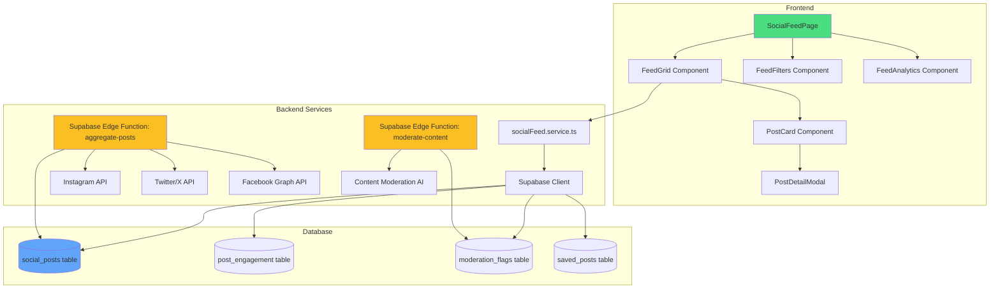

# Design Document

## Overview

The Social Media Feed feature integrates an Instagram-like feed into the #GangGreen platform, aggregating posts from Instagram, Twitter/X, and Facebook that use the #GangGreen hashtag. This feature showcases real-world community engagement, provides social proof, and encourages broader participation in conservation initiatives.

The system consists of three main layers:
1. **Frontend Layer**: React components for displaying and interacting with the feed
2. **Backend Layer**: Supabase Edge Functions for API aggregation and content moderation
3. **Data Layer**: PostgreSQL tables for storing posts, engagement metrics, and moderation data

## Architecture

### High-Level Architecture



### Data Flow

1. **Post Aggregation Flow**:
   - Scheduled Supabase Edge Function runs every 15 minutes
   - Fetches posts from Instagram, Twitter/X, and Facebook APIs
   - Processes and normalizes post data
   - Stores in `social_posts` table
   - Triggers content moderation check

2. **Content Display Flow**:
   - User navigates to Social Feed page
   - Frontend fetches paginated posts from Supabase
   - Posts are rendered in responsive grid layout
   - Lazy loading for images and infinite scroll for pagination

3. **Moderation Flow**:
   - New posts trigger automatic moderation check
   - AI analyzes content for inappropriate material
   - Flagged posts are hidden and sent to admin review queue
   - Admins approve/reject through dashboard

## Components and Interfaces

### Frontend Components

#### 1. SocialFeedPage (Page Component)
**Location**: `src/pages/SocialFeedPage.tsx`

**Purpose**: Main page container for the social media feed

**Props**: None (uses React Router for routing)

**State**:
```typescript
interface SocialFeedPageState {
  posts: SocialPost[];
  filters: FeedFilters;
  loading: boolean;
  hasMore: boolean;
  page: number;
}
```

**Key Features**:
- Manages overall feed state
- Handles filter changes
- Implements infinite scroll pagination
- Coordinates between child components

---

#### 2. FeedGrid Component
**Location**: `src/components/social/FeedGrid.tsx`

**Purpose**: Renders posts in a responsive masonry/grid layout

**Props**:
```typescript
interface FeedGridProps {
  posts: SocialPost[];
  loading: boolean;
  onPostClick: (post: SocialPost) => void;
  onLoadMore: () => void;
  hasMore: boolean;
}
```

**Layout Strategy**:
- CSS Grid with auto-fit columns (responsive)
- Minimum column width: 300px
- Gap: 16px
- Masonry effect using `grid-auto-rows: masonry` (with fallback)

---

#### 3. PostCard Component
**Location**: `src/components/social/PostCard.tsx`

**Purpose**: Individual post card displaying image, caption, and metadata

**Props**:
```typescript
interface PostCardProps {
  post: SocialPost;
  onClick: (post: SocialPost) => void;
  onSave?: (postId: string) => void;
  isSaved?: boolean;
}
```

**Visual Elements**:
- Post image/video (lazy loaded)
- Platform icon badge (Instagram/Twitter/Facebook)
- Author avatar and name
- Truncated caption (max 2 lines)
- Engagement metrics (likes, comments, shares)
- Hover overlay with "View Details" button
- Save/bookmark icon (for authenticated users)

**Styling**: Tailwind CSS with hover effects and transitions

---

#### 4. PostDetailModal Component
**Location**: `src/components/social/PostDetailModal.tsx`

**Purpose**: Full-screen modal showing complete post details

**Props**:
```typescript
interface PostDetailModalProps {
  post: SocialPost | null;
  isOpen: boolean;
  onClose: () => void;
}
```

**Features**:
- Full-size image/video display
- Complete caption text
- Full engagement metrics
- "View on [Platform]" external link button
- Social share buttons (Twitter, Facebook, LinkedIn, Copy Link)
- Save/unsave functionality
- Close button and backdrop click to close

---

#### 5. FeedFilters Component
**Location**: `src/components/social/FeedFilters.tsx`

**Purpose**: Filter controls for the feed

**Props**:
```typescript
interface FeedFiltersProps {
  filters: FeedFilters;
  onFilterChange: (filters: FeedFilters) => void;
}
```

**Filter Options**:
- Platform selector (All, Instagram, Twitter, Facebook)
- Date range picker (Last 7 days, Last 30 days, Custom range)
- Location filter (All, Kakamega, Karura, Mau)
- Search input (caption, author, location text)
- Sort by (Most recent, Most popular)

**UI Pattern**: Horizontal filter bar with dropdowns and search input

---

#### 6. FeedAnalytics Component
**Location**: `src/components/social/FeedAnalytics.tsx`

**Purpose**: Admin dashboard for social media analytics

**Props**: None (fetches data internally)

**Metrics Displayed**:
- Total posts count
- Total engagement (likes + comments + shares)
- Unique authors count
- Platform breakdown (pie chart)
- Engagement trends over time (line chart)
- Top 10 posts by engagement
- Export to CSV button

**Charts**: Uses Recharts library

---

### Backend Services

#### 1. socialFeed.service.ts
**Location**: `src/services/socialFeed.service.ts`

**Purpose**: Frontend service for interacting with social feed data

**Key Methods**:

```typescript
class SocialFeedService {
  // Fetch paginated posts with filters
  async getPosts(filters: FeedFilters, page: number, limit: number): Promise<SocialPost[]>
  
  // Get single post by ID
  async getPostById(postId: string): Promise<SocialPost>
  
  // Save post to user's saved collection
  async savePost(postId: string, userId: string): Promise<void>
  
  // Remove post from saved collection
  async unsavePost(postId: string, userId: string): Promise<void>
  
  // Check if post is saved by user
  async isPostSaved(postId: string, userId: string): Promise<boolean>
  
  // Get analytics data (admin only)
  async getAnalytics(dateRange: DateRange): Promise<FeedAnalytics>
  
  // Get top posts by engagement
  async getTopPosts(limit: number): Promise<SocialPost[]>
}
```

**Error Handling**: All methods use try-catch with typed error responses

---

#### 2. Supabase Edge Function: aggregate-posts
**Location**: `supabase/functions/aggregate-posts/index.ts`

**Purpose**: Scheduled function to fetch posts from social media APIs

**Trigger**: Cron schedule (every 15 minutes)

**Process Flow**:
1. Fetch posts from Instagram API (using Instagram Basic Display API or Graph API)
2. Fetch posts from Twitter/X API (using Twitter API v2 with #GangGreen search)
3. Fetch posts from Facebook API (using Graph API with hashtag search)
4. Normalize post data to common schema
5. Check for duplicates (by external post ID)
6. Insert new posts into `social_posts` table
7. Trigger content moderation for new posts
8. Log aggregation metrics

**API Integration**:
- Instagram: Graph API with hashtag search endpoint
- Twitter/X: API v2 with recent search endpoint
- Facebook: Graph API with hashtag search

**Rate Limiting**: Implements exponential backoff and request queuing

---

#### 3. Supabase Edge Function: moderate-content
**Location**: `supabase/functions/moderate-content/index.ts`

**Purpose**: Automated content moderation using AI

**Trigger**: Called after new posts are inserted

**Moderation Checks**:
1. Profanity detection (using profanity filter library)
2. Spam detection (keyword matching and pattern analysis)
3. Sentiment analysis (using OpenAI Moderation API or similar)
4. Image content analysis (using Cloud Vision API for inappropriate images)

**Actions**:
- If content passes: Mark as `approved`
- If content fails: Mark as `flagged`, hide from public feed, notify admins
- Store moderation results in `moderation_flags` table

---

### Custom Hooks

#### 1. useSocialFeed Hook
**Location**: `src/hooks/useSocialFeed.ts`

**Purpose**: Manages social feed state and operations

```typescript
interface UseSocialFeedReturn {
  posts: SocialPost[];
  loading: boolean;
  error: Error | null;
  hasMore: boolean;
  filters: FeedFilters;
  setFilters: (filters: FeedFilters) => void;
  loadMore: () => Promise<void>;
  refresh: () => Promise<void>;
}

function useSocialFeed(): UseSocialFeedReturn
```

**Features**:
- Manages pagination state
- Handles filter changes with debouncing
- Implements infinite scroll logic
- Caches results for 5 minutes
- Automatic refresh on filter change

---

#### 2. useSavedPosts Hook
**Location**: `src/hooks/useSavedPosts.ts`

**Purpose**: Manages user's saved posts

```typescript
interface UseSavedPostsReturn {
  savedPostIds: Set<string>;
  savePost: (postId: string) => Promise<void>;
  unsavePost: (postId: string) => Promise<void>;
  isSaved: (postId: string) => boolean;
  loading: boolean;
}

function useSavedPosts(userId: string): UseSavedPostsReturn
```

---

## Data Models

### Database Tables

#### 1. social_posts Table

```sql
CREATE TABLE social_posts (
  id UUID PRIMARY KEY DEFAULT uuid_generate_v4(),
  external_id VARCHAR(255) UNIQUE NOT NULL, -- Original post ID from platform
  platform VARCHAR(50) NOT NULL, -- 'instagram', 'twitter', 'facebook'
  author_name VARCHAR(255) NOT NULL,
  author_username VARCHAR(255) NOT NULL,
  author_avatar_url TEXT,
  author_profile_url TEXT,
  caption TEXT,
  media_type VARCHAR(50) NOT NULL, -- 'image', 'video', 'carousel'
  media_url TEXT NOT NULL,
  media_thumbnail_url TEXT,
  post_url TEXT NOT NULL,
  likes_count INTEGER DEFAULT 0,
  comments_count INTEGER DEFAULT 0,
  shares_count INTEGER DEFAULT 0,
  location_tag VARCHAR(255), -- e.g., 'Kakamega Forest'
  posted_at TIMESTAMP WITH TIME ZONE NOT NULL,
  fetched_at TIMESTAMP WITH TIME ZONE DEFAULT NOW(),
  moderation_status VARCHAR(50) DEFAULT 'pending', -- 'pending', 'approved', 'flagged', 'rejected'
  is_visible BOOLEAN DEFAULT true,
  created_at TIMESTAMP WITH TIME ZONE DEFAULT NOW(),
  updated_at TIMESTAMP WITH TIME ZONE DEFAULT NOW()
);

-- Indexes
CREATE INDEX idx_social_posts_platform ON social_posts(platform);
CREATE INDEX idx_social_posts_posted_at ON social_posts(posted_at DESC);
CREATE INDEX idx_social_posts_moderation_status ON social_posts(moderation_status);
CREATE INDEX idx_social_posts_location_tag ON social_posts(location_tag);
CREATE INDEX idx_social_posts_visible ON social_posts(is_visible) WHERE is_visible = true;
```

---

#### 2. post_engagement Table

```sql
CREATE TABLE post_engagement (
  id UUID PRIMARY KEY DEFAULT uuid_generate_v4(),
  post_id UUID REFERENCES social_posts(id) ON DELETE CASCADE,
  likes_count INTEGER DEFAULT 0,
  comments_count INTEGER DEFAULT 0,
  shares_count INTEGER DEFAULT 0,
  recorded_at TIMESTAMP WITH TIME ZONE DEFAULT NOW(),
  created_at TIMESTAMP WITH TIME ZONE DEFAULT NOW()
);

-- Index for time-series queries
CREATE INDEX idx_post_engagement_recorded_at ON post_engagement(recorded_at DESC);
CREATE INDEX idx_post_engagement_post_id ON post_engagement(post_id);
```

**Purpose**: Tracks engagement metrics over time for analytics

---

#### 3. moderation_flags Table

```sql
CREATE TABLE moderation_flags (
  id UUID PRIMARY KEY DEFAULT uuid_generate_v4(),
  post_id UUID REFERENCES social_posts(id) ON DELETE CASCADE,
  flag_type VARCHAR(100) NOT NULL, -- 'profanity', 'spam', 'inappropriate_image', 'negative_sentiment'
  confidence_score DECIMAL(3,2), -- 0.00 to 1.00
  flagged_by VARCHAR(50) DEFAULT 'system', -- 'system' or admin user ID
  reviewed_by UUID REFERENCES auth.users(id),
  review_decision VARCHAR(50), -- 'approved', 'rejected'
  review_notes TEXT,
  flagged_at TIMESTAMP WITH TIME ZONE DEFAULT NOW(),
  reviewed_at TIMESTAMP WITH TIME ZONE,
  created_at TIMESTAMP WITH TIME ZONE DEFAULT NOW()
);

CREATE INDEX idx_moderation_flags_post_id ON moderation_flags(post_id);
CREATE INDEX idx_moderation_flags_reviewed ON moderation_flags(reviewed_at) WHERE reviewed_at IS NULL;
```

---

#### 4. saved_posts Table

```sql
CREATE TABLE saved_posts (
  id UUID PRIMARY KEY DEFAULT uuid_generate_v4(),
  user_id UUID REFERENCES auth.users(id) ON DELETE CASCADE,
  post_id UUID REFERENCES social_posts(id) ON DELETE CASCADE,
  saved_at TIMESTAMP WITH TIME ZONE DEFAULT NOW(),
  created_at TIMESTAMP WITH TIME ZONE DEFAULT NOW(),
  UNIQUE(user_id, post_id)
);

CREATE INDEX idx_saved_posts_user_id ON saved_posts(user_id);
CREATE INDEX idx_saved_posts_post_id ON saved_posts(post_id);
```

---

### TypeScript Interfaces

#### Core Types

```typescript
// src/types/socialFeed.types.ts

export type Platform = 'instagram' | 'twitter' | 'facebook';
export type MediaType = 'image' | 'video' | 'carousel';
export type ModerationStatus = 'pending' | 'approved' | 'flagged' | 'rejected';

export interface SocialPost {
  id: string;
  externalId: string;
  platform: Platform;
  author: {
    name: string;
    username: string;
    avatarUrl: string;
    profileUrl: string;
  };
  caption: string;
  media: {
    type: MediaType;
    url: string;
    thumbnailUrl?: string;
  };
  postUrl: string;
  engagement: {
    likes: number;
    comments: number;
    shares: number;
  };
  locationTag?: string;
  postedAt: string;
  fetchedAt: string;
  moderationStatus: ModerationStatus;
  isVisible: boolean;
}

export interface FeedFilters {
  platform?: Platform | 'all';
  dateRange?: {
    start: Date;
    end: Date;
  };
  location?: string | 'all';
  searchQuery?: string;
  sortBy?: 'recent' | 'popular';
}

export interface FeedAnalytics {
  totalPosts: number;
  totalEngagement: number;
  uniqueAuthors: number;
  platformBreakdown: {
    platform: Platform;
    count: number;
    engagement: number;
  }[];
  engagementTrend: {
    date: string;
    engagement: number;
  }[];
  topPosts: SocialPost[];
}

export interface ModerationFlag {
  id: string;
  postId: string;
  flagType: string;
  confidenceScore: number;
  flaggedBy: string;
  reviewedBy?: string;
  reviewDecision?: 'approved' | 'rejected';
  reviewNotes?: string;
  flaggedAt: string;
  reviewedAt?: string;
}
```

---

## Error Handling

### Frontend Error Handling

1. **Network Errors**: Display toast notification with retry button
2. **API Errors**: Show user-friendly error messages
3. **Loading States**: Skeleton loaders for posts during fetch
4. **Empty States**: Custom empty state component when no posts match filters
5. **Image Load Failures**: Fallback placeholder image

### Backend Error Handling

1. **API Rate Limits**: Exponential backoff with max retry attempts
2. **Invalid API Responses**: Log error and skip post
3. **Database Errors**: Transaction rollback and error logging
4. **Moderation API Failures**: Default to manual review queue

### Error Logging

- Frontend: Log errors to console in development, send to monitoring service in production
- Backend: Structured logging with Supabase Edge Function logs
- Critical errors trigger admin notifications

---

## Testing Strategy

### Unit Tests

**Components to Test**:
- `PostCard`: Rendering, click handlers, save functionality
- `FeedFilters`: Filter state management, onChange callbacks
- `PostDetailModal`: Modal open/close, external link navigation

**Services to Test**:
- `socialFeed.service.ts`: All CRUD operations with mocked Supabase client
- Filter logic and pagination

**Test Framework**: Vitest with React Testing Library

---

### Integration Tests

**Scenarios**:
1. End-to-end feed loading with filters
2. Infinite scroll pagination
3. Save/unsave post flow
4. Post detail modal interaction
5. Analytics data fetching and display

**Test Environment**: Supabase local development instance

---

### E2E Tests

**User Flows** (using Playwright):
1. Navigate to social feed page
2. Scroll through posts (infinite scroll)
3. Apply filters and verify results
4. Click post to open detail modal
5. Save post and verify in saved collection
6. Admin: Review flagged posts and approve/reject

---

## Performance Optimizations

### Frontend Optimizations

1. **Lazy Loading**: Images loaded only when in viewport (Intersection Observer)
2. **Virtual Scrolling**: Consider react-window for large lists (if needed)
3. **Memoization**: Use React.memo for PostCard components
4. **Debouncing**: Search input debounced by 300ms
5. **Caching**: Cache API responses for 5 minutes using React Query or SWR
6. **Code Splitting**: Lazy load PostDetailModal and FeedAnalytics components

### Backend Optimizations

1. **Database Indexing**: Indexes on frequently queried columns
2. **Query Optimization**: Use Supabase's query builder efficiently
3. **Pagination**: Limit queries to 20 posts per page
4. **Caching**: Cache aggregated posts for 15 minutes
5. **Batch Processing**: Fetch posts from all platforms in parallel

### API Rate Limit Management

- Instagram: 200 requests/hour (Graph API)
- Twitter: 450 requests/15 minutes (API v2)
- Facebook: 200 requests/hour (Graph API)

**Strategy**: Distribute requests evenly, implement request queue with priority

---

## Security Considerations

1. **API Keys**: Store social media API keys in Supabase secrets (not in code)
2. **Content Moderation**: Automated filtering prevents inappropriate content
3. **XSS Prevention**: Sanitize user-generated content (captions) before rendering
4. **CORS**: Configure Supabase Edge Functions with appropriate CORS headers
5. **Rate Limiting**: Implement rate limiting on public API endpoints
6. **Authentication**: Saved posts feature requires authentication
7. **Admin Access**: Analytics and moderation dashboard restricted to admin role

---

## External API Integration Details

### Instagram Graph API

**Endpoint**: `GET /ig_hashtag_search`

**Authentication**: Facebook App Access Token

**Request**:
```
GET https://graph.instagram.com/ig_hashtag_search?user_id={user_id}&q=GangGreen
```

**Response**: Returns hashtag ID, then fetch recent media

**Rate Limit**: 200 requests/hour

---

### Twitter API v2

**Endpoint**: `GET /2/tweets/search/recent`

**Authentication**: Bearer Token

**Request**:
```
GET https://api.twitter.com/2/tweets/search/recent?query=%23GangGreen&max_results=100
```

**Response**: Returns tweets with media, user info, and engagement metrics

**Rate Limit**: 450 requests/15 minutes

---

### Facebook Graph API

**Endpoint**: `GET /search`

**Authentication**: App Access Token

**Request**:
```
GET https://graph.facebook.com/v18.0/search?type=post&q=%23GangGreen
```

**Response**: Returns public posts with hashtag

**Rate Limit**: 200 requests/hour

---

## Deployment Considerations

### Environment Variables

Add to `.env`:
```
VITE_INSTAGRAM_ACCESS_TOKEN=<secret>
VITE_TWITTER_BEARER_TOKEN=<secret>
VITE_FACEBOOK_ACCESS_TOKEN=<secret>
VITE_OPENAI_API_KEY=<secret> # For content moderation
```

### Supabase Configuration

1. Deploy Edge Functions:
   ```bash
   supabase functions deploy aggregate-posts
   supabase functions deploy moderate-content
   ```

2. Set up cron job for `aggregate-posts`:
   ```sql
   SELECT cron.schedule(
     'aggregate-social-posts',
     '*/15 * * * *', -- Every 15 minutes
     $$SELECT net.http_post(
       url:='https://wobpryllvdjaapzjbsxx.supabase.co/functions/v1/aggregate-posts',
       headers:='{"Authorization": "Bearer <anon_key>"}'::jsonb
     )$$
   );
   ```

3. Enable Row Level Security (RLS) on all tables

### Database Migrations

Create migration file: `supabase/migrations/015_add_social_feed_tables.sql`

Include all table creation, indexes, and RLS policies

---

## Future Enhancements

1. **Real-time Updates**: Use Supabase real-time subscriptions for live feed updates
2. **User-Generated Posts**: Allow platform users to post directly to the feed
3. **Advanced Analytics**: ML-based insights on engagement patterns
4. **Multi-language Support**: Translate captions using translation API
5. **Video Support**: Enhanced video player with controls
6. **Stories Feature**: Instagram-style stories for time-limited content
7. **Hashtag Trending**: Track trending hashtags related to conservation
8. **Influencer Identification**: Identify and highlight influential contributors
