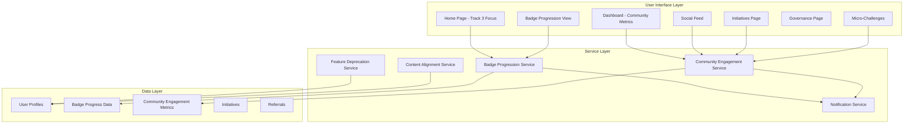
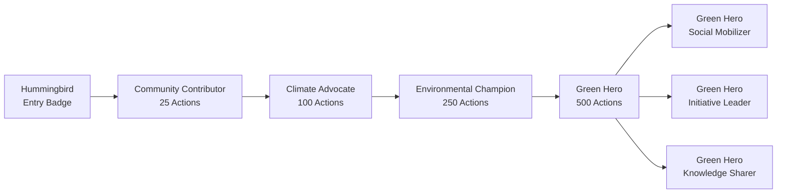

# Design Document: Track 3 Platform Refinement

## Overview

The Track 3 Platform Refinement transforms the #GangGreen platform to focus exclusively on Community Engagement and Sustainability for the Wangari Maathai Hackathon submission. This design removes tree planting transactions and carbon credit marketplace features while restructuring the badge progression system to emphasize social mobilization, micro-actions, and community impact.

The new badge system establishes a clear progression path inspired by the hummingbird story: users begin with the Hummingbird badge (awarded upon signup) and progress through Community Contributor, Climate Advocate, and Environmental Champion tiers before reaching the prestigious Green Hero badge. Green Hero holders can then earn specialized variants (Social Mobilizer, Initiative Leader, Knowledge Sharer) based on their specific contributions.

This design maintains the platform's technical architecture while refocusing user flows, UI components, and reward mechanisms on Track 3 priorities. All existing features related to social engagement, initiatives, governance, and micro-challenges remain active and enhanced, while tree planting and carbon credit features are deprecated for the Track 3 submission.

## Architecture

### High-Level System Architecture




### Badge Progression Architecture

The badge system is redesigned around community engagement metrics rather than tree planting:



### Feature Deprecation Strategy

Tree planting and carbon credit features are handled through a deprecation layer:

```typescript
// Feature flag system
interface FeatureFlags {
  treePlanting: boolean;
  carbonCredits: boolean;
  marketplace: boolean;
}

// Track 3 configuration
const TRACK_3_FLAGS: FeatureFlags = {
  treePlanting: false,
  carbonCredits: false,
  marketplace: false
};
```

## Components and Interfaces

### 1. Badge Progression System

#### BadgeProgressionService

```typescript
interface BadgeProgressionService {
  // Badge management
  getCurrentBadge(userId: string): Promise<Badge>;
  getNextBadge(userId: string): Promise<Badge | null>;
  checkBadgeEligibility(userId: string, badgeId: string): Promise<boolean>;
  awardBadge(userId: string, badgeId: string): Promise<BadgeAward>;
  
  // Progress tracking
  getProgressToNextBadge(userId: string): Promise<BadgeProgress>;
  calculateEngagementScore(userId: string): Promise<number>;
  
  // Green Hero variants
  checkVariantEligibility(userId: string): Promise<GreenHeroVariant[]>;
  awardVariant(userId: string, variant: GreenHeroVariant): Promise<void>;
}

interface Badge {
  id: string;
  name: string;
  tier: BadgeTier;
  description: string;
  requirements: BadgeRequirement[];
  iconUrl: string;
  order: number;
}

enum BadgeTier {
  HUMMINGBIRD = 'hummingbird',
  COMMUNITY_CONTRIBUTOR = 'community_contributor',
  CLIMATE_ADVOCATE = 'climate_advocate',
  ENVIRONMENTAL_CHAMPION = 'environmental_champion',
  GREEN_HERO = 'green_hero'
}

interface BadgeRequirement {
  type: 'actions' | 'social_posts' | 'initiatives' | 'referrals';
  count: number;
  description: string;
}

interface BadgeProgress {
  currentBadge: Badge;
  nextBadge: Badge | null;
  progressPercentage: number;
  requirementProgress: RequirementProgress[];
}

interface RequirementProgress {
  requirement: BadgeRequirement;
  current: number;
  target: number;
  isComplete: boolean;
}

enum GreenHeroVariant {
  SOCIAL_MOBILIZER = 'social_mobilizer',
  INITIATIVE_LEADER = 'initiative_leader',
  KNOWLEDGE_SHARER = 'knowledge_sharer'
}
```


#### BadgeProgressionView Component

```typescript
interface BadgeProgressionViewProps {
  userId: string;
}

const BadgeProgressionView: React.FC<BadgeProgressionViewProps> = ({ userId }) => {
  const { currentBadge, nextBadge, progress } = useBadgeProgression(userId);
  
  return (
    <GlassCard>
      <CurrentBadgeDisplay badge={currentBadge} />
      <ProgressBar percentage={progress.progressPercentage} />
      <RequirementsList requirements={progress.requirementProgress} />
      {nextBadge && <NextBadgePreview badge={nextBadge} />}
      <BadgeTimeline allBadges={getAllBadges()} currentBadge={currentBadge} />
    </GlassCard>
  );
};
```

#### HummingbirdWelcome Component

```typescript
interface HummingbirdWelcomeProps {
  onComplete: () => void;
}

const HummingbirdWelcome: React.FC<HummingbirdWelcomeProps> = ({ onComplete }) => {
  return (
    <Modal isOpen={true} size="large">
      <HummingbirdAnimation />
      <WelcomeMessage>
        <h2>Welcome to #GangGreen!</h2>
        <p>You've earned your first badge: The Hummingbird</p>
        <HummingbirdStory />
        <p>Like the hummingbird, every small action counts. Start your journey today!</p>
      </WelcomeMessage>
      <NextStepsPreview />
      <GlassButton onClick={onComplete}>Begin My Journey</GlassButton>
    </Modal>
  );
};
```

### 2. Community Engagement Metrics

#### CommunityEngagementService

```typescript
interface CommunityEngagementService {
  // Metrics calculation
  calculateEngagementScore(userId: string): Promise<EngagementScore>;
  getEngagementBreakdown(userId: string): Promise<EngagementBreakdown>;
  
  // Action tracking
  trackAction(userId: string, action: EngagementAction): Promise<void>;
  getActionHistory(userId: string, filters?: ActionFilters): Promise<Action[]>;
  
  // Social metrics
  getSocialMetrics(userId: string): Promise<SocialMetrics>;
  trackSocialEngagement(userId: string, engagement: SocialEngagement): Promise<void>;
  
  // Initiative metrics
  getInitiativeMetrics(userId: string): Promise<InitiativeMetrics>;
  
  // Referral metrics
  getReferralMetrics(userId: string): Promise<ReferralMetrics>;
}

interface EngagementScore {
  total: number;
  breakdown: {
    actions: number;
    social: number;
    initiatives: number;
    referrals: number;
  };
  rank: number;
  percentile: number;
}

interface EngagementBreakdown {
  actionsCompleted: number;
  socialPostsCreated: number;
  postsLiked: number;
  commentsPosted: number;
  initiativesJoined: number;
  initiativesCreated: number;
  referralsMade: number;
  referralsActive: number;
}

interface EngagementAction {
  type: 'micro_challenge' | 'social_post' | 'initiative_join' | 'initiative_create' | 'referral';
  points: number;
  metadata?: Record<string, any>;
}

interface SocialMetrics {
  postsCreated: number;
  totalLikes: number;
  totalComments: number;
  totalShares: number;
  engagementRate: number;
  topPost?: Post;
}

interface InitiativeMetrics {
  joined: number;
  created: number;
  completed: number;
  tasksCompleted: number;
  impactScore: number;
}

interface ReferralMetrics {
  totalReferrals: number;
  activeReferrals: number;
  conversionRate: number;
  pointsEarned: number;
  nextMilestone: ReferralMilestone;
}
```


#### CommunityDashboard Component

```typescript
const CommunityDashboard: React.FC = () => {
  const { user } = useAuth();
  const engagement = useCommunityEngagement(user.id);
  const badgeProgress = useBadgeProgression(user.id);
  
  return (
    <DashboardLayout>
      <WelcomeSection user={user} currentBadge={badgeProgress.currentBadge} />
      
      <MetricsGrid>
        <StatsCard
          title="Actions Completed"
          value={engagement.actionsCompleted}
          icon="check-circle"
          trend={engagement.actionsTrend}
        />
        <StatsCard
          title="Social Posts"
          value={engagement.socialPostsCreated}
          icon="message-square"
          trend={engagement.socialTrend}
        />
        <StatsCard
          title="Initiatives Joined"
          value={engagement.initiativesJoined}
          icon="users"
          trend={engagement.initiativesTrend}
        />
        <StatsCard
          title="Referrals Made"
          value={engagement.referralsMade}
          icon="user-plus"
          trend={engagement.referralsTrend}
        />
      </MetricsGrid>
      
      <BadgeProgressCard progress={badgeProgress} />
      
      <RecentActivity activities={engagement.recentActivities} />
      
      <QuickActions>
        <ActionButton icon="target" label="View Challenges" to="/challenges" />
        <ActionButton icon="users" label="Join Initiative" to="/initiatives" />
        <ActionButton icon="share-2" label="Invite Friends" to="/referrals" />
        <ActionButton icon="message-circle" label="Share Story" to="/social/create" />
      </QuickActions>
    </DashboardLayout>
  );
};
```

### 3. Feature Deprecation Layer

#### FeatureDeprecationService

```typescript
interface FeatureDeprecationService {
  // Feature flags
  isFeatureEnabled(feature: DeprecatedFeature): boolean;
  getFeatureStatus(feature: DeprecatedFeature): FeatureStatus;
  
  // Navigation handling
  shouldShowNavItem(navItem: string): boolean;
  getRedirectForDeprecatedRoute(route: string): string | null;
  
  // UI component visibility
  shouldRenderComponent(componentId: string): boolean;
  
  // Data access
  filterDeprecatedData<T>(data: T[], dataType: string): T[];
}

enum DeprecatedFeature {
  TREE_PLANTING = 'tree_planting',
  CARBON_CREDITS = 'carbon_credits',
  MARKETPLACE = 'marketplace'
}

interface FeatureStatus {
  enabled: boolean;
  deprecatedAt?: Date;
  removalDate?: Date;
  alternativeFeature?: string;
  message?: string;
}

// Implementation
class Track3FeatureDeprecation implements FeatureDeprecationService {
  private readonly deprecatedFeatures = new Set([
    DeprecatedFeature.TREE_PLANTING,
    DeprecatedFeature.CARBON_CREDITS,
    DeprecatedFeature.MARKETPLACE
  ]);
  
  isFeatureEnabled(feature: DeprecatedFeature): boolean {
    return !this.deprecatedFeatures.has(feature);
  }
  
  shouldShowNavItem(navItem: string): boolean {
    const deprecatedNavItems = ['trees', 'marketplace', 'carbon-credits'];
    return !deprecatedNavItems.includes(navItem.toLowerCase());
  }
  
  getRedirectForDeprecatedRoute(route: string): string | null {
    const redirectMap: Record<string, string> = {
      '/trees': '/initiatives',
      '/marketplace': '/badges',
      '/carbon-credits': '/initiatives'
    };
    return redirectMap[route] || null;
  }
}
```


#### DeprecatedRouteHandler Component

```typescript
const DeprecatedRouteHandler: React.FC = () => {
  const location = useLocation();
  const navigate = useNavigate();
  const deprecationService = useFeatureDeprecation();
  
  useEffect(() => {
    const redirect = deprecationService.getRedirectForDeprecatedRoute(location.pathname);
    if (redirect) {
      navigate(redirect, { replace: true });
    }
  }, [location.pathname]);
  
  return null;
};

// Usage in App.tsx
<Routes>
  <Route path="/trees" element={<DeprecatedRouteHandler />} />
  <Route path="/marketplace" element={<DeprecatedRouteHandler />} />
  <Route path="/carbon-credits" element={<DeprecatedRouteHandler />} />
  {/* Active routes */}
  <Route path="/initiatives" element={<InitiativesPage />} />
  <Route path="/badges" element={<BadgeProgressionPage />} />
</Routes>
```

### 4. Content Alignment System

#### ContentAlignmentService

```typescript
interface ContentAlignmentService {
  // Documentation updates
  updateDocumentation(docType: DocumentationType): Promise<void>;
  validateContentAlignment(content: string): ContentValidation;
  
  // UI text updates
  getAlignedText(key: string): string;
  updateComponentText(componentId: string, updates: TextUpdates): Promise<void>;
  
  // Feature descriptions
  getFeatureDescription(feature: string): FeatureDescription;
  updateFeatureDescriptions(updates: FeatureDescriptionUpdate[]): Promise<void>;
}

enum DocumentationType {
  README = 'readme',
  TRACK_3_SUBMISSION = 'track_3_submission',
  PLATFORM_OVERVIEW = 'platform_overview',
  FEATURE_DOCS = 'feature_docs'
}

interface ContentValidation {
  isAligned: boolean;
  issues: ContentIssue[];
  suggestions: string[];
}

interface ContentIssue {
  type: 'deprecated_feature_mention' | 'incorrect_focus' | 'outdated_metric';
  location: string;
  description: string;
  severity: 'high' | 'medium' | 'low';
}

interface FeatureDescription {
  name: string;
  shortDescription: string;
  longDescription: string;
  category: 'community' | 'engagement' | 'governance' | 'gamification';
  track3Relevant: boolean;
}
```

#### Track3HomePage Component

```typescript
const Track3HomePage: React.FC = () => {
  return (
    <HomePage>
      <HeroSection>
        <HummingbirdAnimation />
        <Heading>Every Small Action Counts</Heading>
        <Subheading>
          Join thousands making a difference through micro-actions and community engagement
        </Subheading>
        <CTAButtons>
          <GlassButton variant="primary" to="/register">
            Start Your Journey
          </GlassButton>
          <GlassButton variant="secondary" to="/about">
            Learn More
          </GlassButton>
        </CTAButtons>
      </HeroSection>
      
      <BadgeProgressionShowcase />
      
      <CommunityImpactMetrics>
        <MetricCard icon="users" value="10,000+" label="Active Community Members" />
        <MetricCard icon="target" value="500,000+" label="Micro-Actions Completed" />
        <MetricCard icon="award" value="25,000+" label="Badges Earned" />
        <MetricCard icon="share-2" value="50,000+" label="Stories Shared" />
      </CommunityImpactMetrics>
      
      <FeatureHighlights>
        <FeatureCard
          icon="target"
          title="Micro-Challenges"
          description="Complete daily climate actions and earn rewards"
        />
        <FeatureCard
          icon="users"
          title="Community Initiatives"
          description="Join collaborative conservation projects"
        />
        <FeatureCard
          icon="award"
          title="Badge Progression"
          description="Unlock achievements from Hummingbird to Green Hero"
        />
        <FeatureCard
          icon="share-2"
          title="Social Impact"
          description="Share your journey and inspire others"
        />
      </FeatureHighlights>
      
      <HummingbirdStorySection />
      
      <LeaderboardPreview />
      
      <SocialProofSection />
      
      <CallToAction />
    </HomePage>
  );
};
```


### 5. Updated Navigation System

#### Track3NavigationConfig

```typescript
interface NavigationConfig {
  mainNav: NavItem[];
  quickActions: QuickAction[];
  userMenu: UserMenuItem[];
}

const TRACK_3_NAVIGATION: NavigationConfig = {
  mainNav: [
    { id: 'home', label: 'Home', path: '/', icon: 'home' },
    { id: 'challenges', label: 'Challenges', path: '/challenges', icon: 'target' },
    { id: 'initiatives', label: 'Initiatives', path: '/initiatives', icon: 'users' },
    { id: 'social', label: 'Community', path: '/social', icon: 'message-square' },
    { id: 'badges', label: 'My Badges', path: '/badges', icon: 'award' },
    { id: 'leaderboard', label: 'Leaderboard', path: '/leaderboard', icon: 'trophy' },
    { id: 'governance', label: 'Governance', path: '/governance', icon: 'vote' }
  ],
  quickActions: [
    { id: 'new-post', label: 'Share Story', action: 'create-post', icon: 'edit' },
    { id: 'join-initiative', label: 'Join Initiative', action: 'browse-initiatives', icon: 'users' },
    { id: 'invite-friend', label: 'Invite Friend', action: 'share-referral', icon: 'user-plus' },
    { id: 'view-challenges', label: 'View Challenges', action: 'browse-challenges', icon: 'target' }
  ],
  userMenu: [
    { id: 'profile', label: 'My Profile', path: '/profile', icon: 'user' },
    { id: 'badges', label: 'My Badges', path: '/badges', icon: 'award' },
    { id: 'referrals', label: 'Referrals', path: '/referrals', icon: 'share-2' },
    { id: 'settings', label: 'Settings', path: '/settings', icon: 'settings' },
    { id: 'logout', label: 'Logout', action: 'logout', icon: 'log-out' }
  ]
};
```

## Data Models

### Badge Progression Tables

```sql
-- Badge definitions
CREATE TABLE badge_tiers (
  id UUID PRIMARY KEY DEFAULT uuid_generate_v4(),
  name VARCHAR(100) NOT NULL UNIQUE,
  tier_order INTEGER NOT NULL UNIQUE,
  description TEXT NOT NULL,
  icon_url TEXT NOT NULL,
  requirements JSONB NOT NULL,
  created_at TIMESTAMPTZ DEFAULT NOW()
);

-- Insert Track 3 badge tiers
INSERT INTO badge_tiers (name, tier_order, description, icon_url, requirements) VALUES
('Hummingbird', 1, 'Welcome badge - Your journey begins', '/badges/hummingbird.svg', 
  '{"actions": 0, "description": "Awarded upon signup"}'),
('Community Contributor', 2, 'Active community member', '/badges/community-contributor.svg',
  '{"actions": 25, "social_posts": 5, "description": "Complete 25 actions and create 5 social posts"}'),
('Climate Advocate', 3, 'Dedicated climate champion', '/badges/climate-advocate.svg',
  '{"actions": 100, "social_posts": 20, "initiatives": 3, "description": "Complete 100 actions, 20 posts, join 3 initiatives"}'),
('Environmental Champion', 4, 'Environmental leader', '/badges/environmental-champion.svg',
  '{"actions": 250, "social_posts": 50, "initiatives": 10, "referrals": 10, "description": "Complete 250 actions, 50 posts, 10 initiatives, 10 referrals"}'),
('Green Hero', 5, 'Ultimate environmental hero', '/badges/green-hero.svg',
  '{"actions": 500, "social_posts": 100, "initiatives": 20, "referrals": 25, "description": "Complete 500 actions, 100 posts, 20 initiatives, 25 referrals"}');

-- Green Hero variants
CREATE TABLE green_hero_variants (
  id UUID PRIMARY KEY DEFAULT uuid_generate_v4(),
  name VARCHAR(100) NOT NULL UNIQUE,
  description TEXT NOT NULL,
  icon_url TEXT NOT NULL,
  requirements JSONB NOT NULL,
  created_at TIMESTAMPTZ DEFAULT NOW()
);

INSERT INTO green_hero_variants (name, description, icon_url, requirements) VALUES
('Social Mobilizer', 'Master of community growth', '/badges/social-mobilizer.svg',
  '{"referrals": 100, "social_engagement": 1000, "description": "100 referrals and 1000 social engagements"}'),
('Initiative Leader', 'Community project champion', '/badges/initiative-leader.svg',
  '{"initiatives_created": 10, "initiatives_completed": 10, "description": "Create and complete 10 initiatives"}'),
('Knowledge Sharer', 'Environmental educator', '/badges/knowledge-sharer.svg',
  '{"educational_posts": 50, "post_engagement": 500, "description": "50 educational posts with 500+ engagements"}');

-- User badge progress
CREATE TABLE user_badge_progress (
  id UUID PRIMARY KEY DEFAULT uuid_generate_v4(),
  user_id UUID REFERENCES users(id) NOT NULL,
  current_badge_id UUID REFERENCES badge_tiers(id) NOT NULL,
  actions_completed INTEGER DEFAULT 0,
  social_posts_created INTEGER DEFAULT 0,
  initiatives_joined INTEGER DEFAULT 0,
  initiatives_created INTEGER DEFAULT 0,
  referrals_made INTEGER DEFAULT 0,
  referrals_active INTEGER DEFAULT 0,
  social_engagement_score INTEGER DEFAULT 0,
  last_updated TIMESTAMPTZ DEFAULT NOW(),
  UNIQUE(user_id)
);

-- User earned badges
CREATE TABLE user_earned_badges (
  id UUID PRIMARY KEY DEFAULT uuid_generate_v4(),
  user_id UUID REFERENCES users(id) NOT NULL,
  badge_id UUID REFERENCES badge_tiers(id) NOT NULL,
  earned_at TIMESTAMPTZ DEFAULT NOW(),
  UNIQUE(user_id, badge_id)
);

-- User earned variants
CREATE TABLE user_earned_variants (
  id UUID PRIMARY KEY DEFAULT uuid_generate_v4(),
  user_id UUID REFERENCES users(id) NOT NULL,
  variant_id UUID REFERENCES green_hero_variants(id) NOT NULL,
  earned_at TIMESTAMPTZ DEFAULT NOW(),
  UNIQUE(user_id, variant_id)
);

CREATE INDEX idx_badge_progress_user ON user_badge_progress(user_id);
CREATE INDEX idx_earned_badges_user ON user_earned_badges(user_id);
CREATE INDEX idx_earned_variants_user ON user_earned_variants(user_id);
```


### Community Engagement Metrics Tables

```sql
-- Engagement actions tracking
CREATE TABLE engagement_actions (
  id UUID PRIMARY KEY DEFAULT uuid_generate_v4(),
  user_id UUID REFERENCES users(id) NOT NULL,
  action_type VARCHAR(50) NOT NULL CHECK (action_type IN (
    'micro_challenge', 'social_post', 'social_like', 'social_comment', 
    'initiative_join', 'initiative_create', 'initiative_task', 'referral'
  )),
  points_awarded INTEGER NOT NULL DEFAULT 0,
  metadata JSONB DEFAULT '{}',
  created_at TIMESTAMPTZ DEFAULT NOW()
);

CREATE INDEX idx_engagement_user ON engagement_actions(user_id);
CREATE INDEX idx_engagement_type ON engagement_actions(action_type);
CREATE INDEX idx_engagement_created ON engagement_actions(created_at DESC);

-- Engagement summary (materialized view for performance)
CREATE MATERIALIZED VIEW user_engagement_summary AS
SELECT 
  user_id,
  COUNT(*) FILTER (WHERE action_type = 'micro_challenge') as challenges_completed,
  COUNT(*) FILTER (WHERE action_type = 'social_post') as posts_created,
  COUNT(*) FILTER (WHERE action_type = 'social_like') as likes_given,
  COUNT(*) FILTER (WHERE action_type = 'social_comment') as comments_made,
  COUNT(*) FILTER (WHERE action_type = 'initiative_join') as initiatives_joined,
  COUNT(*) FILTER (WHERE action_type = 'initiative_create') as initiatives_created,
  COUNT(*) FILTER (WHERE action_type = 'initiative_task') as tasks_completed,
  COUNT(*) FILTER (WHERE action_type = 'referral') as referrals_made,
  SUM(points_awarded) as total_points,
  MAX(created_at) as last_activity
FROM engagement_actions
GROUP BY user_id;

CREATE UNIQUE INDEX idx_engagement_summary_user ON user_engagement_summary(user_id);

-- Refresh materialized view periodically
CREATE OR REPLACE FUNCTION refresh_engagement_summary()
RETURNS void AS $$
BEGIN
  REFRESH MATERIALIZED VIEW CONCURRENTLY user_engagement_summary;
END;
$$ LANGUAGE plpgsql;
```

### Feature Deprecation Configuration

```sql
-- Feature flags table
CREATE TABLE feature_flags (
  id UUID PRIMARY KEY DEFAULT uuid_generate_v4(),
  feature_name VARCHAR(100) NOT NULL UNIQUE,
  is_enabled BOOLEAN NOT NULL DEFAULT true,
  deprecated_at TIMESTAMPTZ,
  removal_date TIMESTAMPTZ,
  alternative_feature VARCHAR(100),
  message TEXT,
  updated_at TIMESTAMPTZ DEFAULT NOW()
);

-- Track 3 feature flags
INSERT INTO feature_flags (feature_name, is_enabled, deprecated_at, alternative_feature, message) VALUES
('tree_planting', false, NOW(), 'initiatives', 'Tree planting features are not included in Track 3 submission'),
('carbon_credits', false, NOW(), 'initiatives', 'Carbon credit marketplace is not included in Track 3 submission'),
('marketplace', false, NOW(), 'badges', 'Marketplace features are not included in Track 3 submission');

-- Function to check feature status
CREATE OR REPLACE FUNCTION is_feature_enabled(feature VARCHAR(100))
RETURNS BOOLEAN AS $$
  SELECT is_enabled FROM feature_flags WHERE feature_name = feature;
$$ LANGUAGE SQL STABLE;
```

## Correctness Properties

*A property is a characteristic or behavior that should hold true across all valid executions of a system-essentially, a formal statement about what the system should do. Properties serve as the bridge between human-readable specifications and machine-verifiable correctness guarantees.*

### Acceptance Criteria Testing Prework

1.1 WHEN a user completes registration, THE Badge Progression System SHALL automatically award the Hummingbird badge
Thoughts: This is a rule that should apply to all new users. We can test this by creating random user registrations and verifying each receives the Hummingbird badge.
Testable: yes - property

1.2 THE Hummingbird Badge SHALL display a welcome message explaining the hummingbird story
Thoughts: This is about UI presentation, which is difficult to test programmatically.
Testable: no

1.3 WHEN the Hummingbird badge is awarded, THE Badge Progression System SHALL trigger a notification
Thoughts: This is a rule about system behavior. We can test that for any user receiving the Hummingbird badge, a notification is created.
Testable: yes - property

2.1 THE Badge Progression System SHALL define the following badge hierarchy: Hummingbird, Community Contributor, Climate Advocate, Environmental Champion, Green Hero
Thoughts: This is about system configuration. We can verify the badge hierarchy is correctly defined.
Testable: yes - example

2.2 WHEN a user completes requirements for a new badge, THE Badge Progression System SHALL award the badge
Thoughts: This is a rule that should apply to all users and all badges. We can test by generating random progress data and verifying badges are awarded when requirements are met.
Testable: yes - property

3.1 WHERE a user has earned the Green Hero badge, THE Badge Progression System SHALL unlock specialized variant paths
Thoughts: This is a rule about what happens after earning Green Hero. We can test that for any user with Green Hero, variants become available.
Testable: yes - property

3.2 WHEN a user earns 100 referrals, THE Badge Progression System SHALL award the Green Hero - Social Mobilizer variant
Thoughts: This is testing a specific threshold. This is an edge case we want to ensure works correctly.
Testable: edge-case

4.1 THE Feature Deprecation SHALL hide or remove all UI components related to tree planting transactions
Thoughts: This is about UI state. We can test that deprecated features don't appear in navigation or component trees.
Testable: yes - property

5.1 THE Badge Progression System SHALL award badges based on micro-actions, social posts, initiatives, and referrals
Thoughts: This is about the calculation logic. We can test that badge progress correctly accounts for these metrics.
Testable: yes - property

5.2 WHEN calculating badge progress, THE Badge Progression System SHALL exclude tree planting counts
Thoughts: This is ensuring deprecated metrics don't affect calculations. We can test that tree planting data doesn't influence badge progress.
Testable: yes - property

6.1 WHEN a user creates a social post, THE Community Engagement Metrics SHALL increment their social action count
Thoughts: This is a rule about all social posts. We can test that for any post creation, the count increases.
Testable: yes - property

7.1 WHEN a user joins an initiative, THE Badge Progression System SHALL award 10 progress points
Thoughts: This is testing a specific point value. This is an important rule to verify.
Testable: yes - property

8.1 WHEN a user's referral link is used for signup, THE Badge Progression System SHALL award 15 progress points
Thoughts: This is testing referral mechanics. We can test that for any successful referral, points are awarded.
Testable: yes - property

9.1 THE Content Alignment SHALL update README.md to remove tree planting feature descriptions
Thoughts: This is about documentation content. We can verify deprecated features aren't mentioned.
Testable: yes - example

12.1 THE Content Alignment SHALL remove "Trees" and "Marketplace" navigation items
Thoughts: This is about navigation configuration. We can verify these items don't exist in the navigation config.
Testable: yes - example

13.1 WHEN a user views their dashboard, THE Community Engagement Metrics SHALL display actions completed, social posts, initiatives, referrals
Thoughts: This is about what data is displayed. We can verify the dashboard includes these metrics.
Testable: yes - example

14.1 THE Badge Progression System SHALL update badge SVG designs to feature community imagery
Thoughts: This is about visual design, which is subjective.
Testable: no


## Correctness Properties

Property 1: Hummingbird badge automatic award
*For any* newly registered user, the system should automatically award the Hummingbird badge upon successful registration completion
**Validates: Requirements 1.1**

Property 2: Badge award notification
*For any* user receiving a badge, the system should create and deliver a notification about the badge award
**Validates: Requirements 1.3**

Property 3: Badge progression on requirement completion
*For any* user and any badge tier, when the user meets all requirements for that badge, the system should award the badge
**Validates: Requirements 2.2**

Property 4: Green Hero variant unlock
*For any* user who has earned the Green Hero badge, the system should make all three variant paths (Social Mobilizer, Initiative Leader, Knowledge Sharer) available for earning
**Validates: Requirements 3.1**

Property 5: Deprecated features hidden from UI
*For any* UI component or navigation element, if it relates to tree planting or carbon credits, it should not be rendered or accessible in Track 3 mode
**Validates: Requirements 4.1**

Property 6: Badge calculation excludes deprecated metrics
*For any* badge progress calculation, tree planting counts and carbon credit purchases should not contribute to the progress score
**Validates: Requirements 5.2**

Property 7: Social action tracking
*For any* social post creation, the user's social action count should increase by exactly one
**Validates: Requirements 6.1**

Property 8: Initiative join points award
*For any* user joining an initiative, the system should award exactly 10 progress points
**Validates: Requirements 7.1**

Property 9: Referral points award
*For any* successful referral (new user signup via referral link), the referrer should receive exactly 15 progress points
**Validates: Requirements 8.1**

Property 10: Engagement score calculation consistency
*For any* user, calculating their engagement score multiple times without intervening actions should return the same value
**Validates: Requirements 5.1**

Property 11: Badge progression monotonicity
*For any* user, their badge tier order should never decrease (users can only progress forward or stay at current tier)
**Validates: Requirements 2.1**

Property 12: Point award idempotency
*For any* single action, points should be awarded exactly once (duplicate action submissions should not award duplicate points)
**Validates: Requirements 7.1, 8.1**

## Error Handling

### Badge Award Failures
- **Scenario**: User meets requirements but badge award fails
- **Handling**: Retry badge award up to 3 times with exponential backoff
- **Fallback**: Queue for manual review if all retries fail
- **User Communication**: Show "Badge pending" status with explanation

### Engagement Metric Calculation Errors
- **Scenario**: Engagement score calculation fails or returns invalid value
- **Handling**: Use cached value if available and less than 5 minutes old
- **Fallback**: Return zero with error flag if no cache available
- **Logging**: Log calculation errors for investigation

### Feature Deprecation Conflicts
- **Scenario**: User attempts to access deprecated feature
- **Handling**: Redirect to alternative feature with informational message
- **Fallback**: Show 404 page if no alternative exists
- **Analytics**: Track deprecated feature access attempts

### Content Alignment Validation Errors
- **Scenario**: Documentation contains references to deprecated features
- **Handling**: Flag for manual review
- **Reporting**: Generate report of all deprecated feature mentions
- **Prevention**: Add pre-commit hooks to check for deprecated terms

## Testing Strategy

### Unit Tests
- Badge progression calculation logic
- Engagement score computation
- Feature flag evaluation
- Point award calculations
- Badge requirement validation
- Variant eligibility checks

### Integration Tests
- Complete user registration to Hummingbird badge flow
- Badge progression through all tiers
- Green Hero variant earning
- Deprecated feature redirection
- Navigation menu filtering
- Dashboard metric display

### Property-Based Tests
Using **fast-check** library for JavaScript/TypeScript property-based testing:

- Property 1: Test with randomly generated user registration data
- Property 2: Test with random badge awards
- Property 3: Test with random progress data meeting various badge requirements
- Property 6: Test with random engagement data including deprecated metrics
- Property 7: Test with random social post creation events
- Property 8: Test with random initiative join events
- Property 9: Test with random referral events
- Property 10: Test with random user IDs and multiple calculation calls
- Property 11: Test with random sequences of user actions
- Property 12: Test with duplicate action submissions

Each property test should run a minimum of 100 iterations to ensure comprehensive coverage.

### End-to-End Tests
- New user journey from signup to first badge
- Complete badge progression path
- Social engagement and badge progress
- Initiative participation and points
- Referral system and rewards
- Deprecated feature access attempts

### Performance Tests
- Badge progress calculation with 100k+ users
- Engagement metric aggregation
- Leaderboard generation
- Real-time badge notifications
- Concurrent badge awards

## Security Considerations

### Badge Integrity
- Prevent badge manipulation through client-side code
- Validate all badge requirements server-side
- Use database constraints to enforce badge hierarchy
- Audit log all badge awards for review

### Point Farming Prevention
- Rate limit action submissions
- Detect suspicious patterns (rapid repeated actions)
- Implement cooldown periods for certain actions
- Flag accounts with abnormal engagement patterns

### Feature Access Control
- Enforce feature flags at API level, not just UI
- Validate feature access on every request
- Log attempts to access deprecated features
- Block API access to deprecated endpoints

### Data Privacy
- Anonymize leaderboard data appropriately
- Allow users to opt out of public rankings
- Secure referral codes against enumeration
- Encrypt sensitive engagement metrics

## Performance Optimization

### Caching Strategy
- Cache badge progress (TTL: 1 minute)
- Cache engagement scores (TTL: 5 minutes)
- Cache leaderboards (TTL: 10 minutes)
- Cache feature flags (TTL: 1 hour)
- Cache navigation config (TTL: 1 day)

### Database Optimization
- Use materialized views for engagement summaries
- Index all foreign keys and frequently queried fields
- Partition engagement_actions table by date
- Use read replicas for analytics queries
- Implement connection pooling

### Real-Time Updates
- Use Supabase real-time for badge notifications
- WebSocket connections for live leaderboards
- Optimistic UI updates for better UX
- Batch notification delivery to reduce load

### Query Optimization
```sql
-- Efficient badge progress query
SELECT 
  ubp.*,
  bt.name as current_badge_name,
  bt.tier_order,
  next_bt.name as next_badge_name,
  next_bt.requirements as next_requirements
FROM user_badge_progress ubp
JOIN badge_tiers bt ON ubp.current_badge_id = bt.id
LEFT JOIN badge_tiers next_bt ON next_bt.tier_order = bt.tier_order + 1
WHERE ubp.user_id = $1;

-- Efficient engagement summary query
SELECT * FROM user_engagement_summary WHERE user_id = $1;
```

## Accessibility

- WCAG 2.1 AA compliance for all new components
- Keyboard navigation for badge progression view
- Screen reader support for badge descriptions
- High contrast mode for badge icons
- Responsive design for mobile badge viewing
- Alternative text for all badge images

## Analytics and Monitoring

### Key Metrics
- Badge progression rates by tier
- Average time to reach each badge
- Green Hero variant distribution
- Engagement score distribution
- Feature deprecation redirect rates
- Navigation pattern changes

### User Behavior Tracking
- Badge progression paths
- Most common actions for badge progress
- Variant earning patterns
- Deprecated feature access attempts
- Navigation menu usage

### System Health
- Badge award success rate
- Engagement calculation performance
- Cache hit rates
- Database query performance
- Real-time notification delivery rates

## Migration Strategy

### Phase 1: Database Setup
1. Create new badge tier tables
2. Create engagement tracking tables
3. Create feature flag tables
4. Set up materialized views
5. Create necessary indexes

### Phase 2: Service Implementation
1. Implement BadgeProgressionService
2. Implement CommunityEngagementService
3. Implement FeatureDeprecationService
4. Implement ContentAlignmentService
5. Add notification triggers

### Phase 3: UI Updates
1. Update navigation configuration
2. Implement badge progression views
3. Update dashboard components
4. Add deprecated route handlers
5. Update home page for Track 3

### Phase 4: Content Updates
1. Update README.md
2. Update TRACK_3_SUBMISSION.md
3. Update platform overview
4. Update feature documentation
5. Update inline code comments

### Phase 5: Testing and Validation
1. Run all unit tests
2. Run integration tests
3. Run property-based tests
4. Perform manual QA
5. Validate content alignment

### Phase 6: Deployment
1. Deploy database migrations
2. Deploy backend services
3. Deploy frontend updates
4. Enable feature flags
5. Monitor for issues

## Rollback Plan

If issues are discovered post-deployment:

1. **Immediate**: Disable feature flags to revert to previous behavior
2. **Database**: Rollback migrations if necessary (backup required)
3. **Frontend**: Revert to previous deployment
4. **Communication**: Notify users of temporary issues
5. **Investigation**: Analyze logs and metrics to identify root cause

