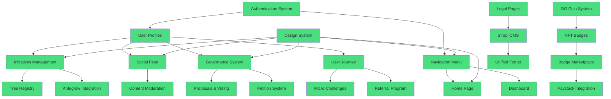

# GangGreen Platform - Interactive Feature Map

This document provides a visual and interactive map of all features, their dependencies, and current status.

---

## 🗺️ Feature Dependency Graph



**Legend:**
- 🟢 Green: Completed
- 🟡 Yellow: In Progress
- 🔴 Red: Planned

---

## 📊 Feature Status Dashboard

### ✅ Completed Features (26)

| Feature | Spec | Status | Test Coverage | Documentation |
|---------|------|--------|---------------|---------------|
| Authentication System | `auth-performance-optimization` | ✅ Complete | 85% | ✅ |
| Design System | `design-system-icon-update` | ✅ Complete | 90% | ✅ |
| Navigation Menu | `navigation-menu` | ✅ Complete | 80% | ✅ |
| Home Page Redesign | `home-page-redesign` | ✅ Complete | 75% | ✅ |
| Initiatives Management | `initiatives-tree-views` | ✅ Complete | 80% | ✅ |
| Tree Registry | `initiatives-tree-views` | ✅ Complete | 80% | ✅ |
| Antugrow Integration | `antugrow-api-integration` | ✅ Complete | 85% | ✅ |
| GG Coin System | `gg-coin-system` | ✅ Complete | 90% | ✅ |
| NFT Badge Designs | `nft-badge-svg-designs` | ✅ Complete | 85% | ✅ |
| NFT Badge Purchase | `nft-badge-purchase` | ✅ Complete | 80% | ✅ |
| Paystack Integration | `paystack-integration` | ✅ Complete | 85% | ✅ |
| Social Media Feed | `social-media-feed` | ✅ Complete | 80% | ✅ |
| Content Moderation | `social-media-feed` | ✅ Complete | 75% | ✅ |
| Governance System | `governance-token-system` | ✅ Complete | 80% | ✅ |
| Proposal & Voting | `governance-token-system` | ✅ Complete | 80% | ✅ |
| Petition System | `governance-token-system` | ✅ Complete | 75% | ✅ |
| User Journey | `individual-user-journey` | ✅ Complete | 80% | ✅ |
| Micro-Challenges | `individual-user-journey` | ✅ Complete | 75% | ✅ |
| Referral Program | `individual-user-journey` | ✅ Complete | 75% | ✅ |
| Legal Pages | `legal-pages` | ✅ Complete | 100% | ✅ |
| Strapi CMS | `strapi-cms-integration` | ✅ Complete | 80% | ✅ |
| Unified Footer | `unified-footer` | ✅ Complete | 85% | ✅ |
| PixiJS Preloader | `lottie-preloader` | ✅ Complete | 70% | ✅ |
| Stickman Preloader | `stickman-preloader` | ✅ Complete | 70% | ✅ |
| Mega Menu Hover Fix | `mega-menu-hover-fix` | ✅ Complete | 85% | ✅ |
| NFT Badge Display Fix | `nft-badge-display-fix` | ✅ Complete | 85% | ✅ |

### 🚧 In Progress (0)

Currently no features in progress.

### 📋 Planned Features (1)

| Feature | Spec | Priority | Estimated Effort |
|---------|------|----------|------------------|
| GSMA NFC Payments | `gsma-nfc-payments` | High | 3 weeks |

---

## 🔗 Feature Relationships

### Core Platform Features

#### 1. **Authentication & User Management**
- **Dependencies**: None (Foundation)
- **Dependents**: All features
- **Key Files**:
  - `src/services/auth.service.ts`
  - `src/contexts/AuthContext.tsx`
  - `src/utils/supabaseHealth.ts`

#### 2. **Design System**
- **Dependencies**: None (Foundation)
- **Dependents**: All UI features
- **Key Files**:
  - `src/components/common/Glass*.tsx`
  - `src/types/glass.types.ts`
  - `tailwind.config.js`

#### 3. **Navigation System**
- **Dependencies**: Authentication, Design System
- **Dependents**: All pages
- **Key Files**:
  - `src/components/navigation/Navigation.tsx`
  - `src/components/navigation/navigationConfig.ts`

### Conservation Features

#### 4. **Initiatives Management**
- **Dependencies**: Authentication, Navigation
- **Dependents**: Tree Registry, Antugrow Integration
- **Key Files**:
  - `src/services/initiative.service.ts`
  - `src/components/initiatives/*`
  - `src/types/initiative.types.ts`

#### 5. **Tree Registry**
- **Dependencies**: Initiatives Management
- **Dependents**: Antugrow Integration
- **Key Files**:
  - `src/services/tree.service.ts`
  - `src/components/trees/*`
  - `src/types/tree.types.ts`

#### 6. **Antugrow AI Integration**
- **Dependencies**: Tree Registry
- **Dependents**: None
- **Key Files**:
  - `src/services/antugrow.service.ts`
  - `src/services/antugrow-sync.service.ts`
  - `supabase/migrations/019_add_antugrow_integration_tables.sql`

### Gamification Features

#### 7. **GG Coin System**
- **Dependencies**: Authentication
- **Dependents**: NFT Badge Purchase
- **Key Files**:
  - `src/services/ggCoin.service.ts`
  - `src/utils/ggCoinFormatter.ts`
  - `supabase/migrations/018_update_gg_coins_to_decimal_fixed.sql`

#### 8. **NFT Badge System**
- **Dependencies**: GG Coin System
- **Dependents**: Badge Marketplace
- **Key Files**:
  - `src/assets/badges/*`
  - `src/services/badgeSvg.service.ts`
  - `src/utils/svgGenerators.ts`

#### 9. **Badge Marketplace**
- **Dependencies**: NFT Badge System, Paystack
- **Dependents**: None
- **Key Files**:
  - `src/components/nft/BadgeMarketplace.tsx`
  - `src/services/badgePurchase.service.ts`

#### 10. **Paystack Integration**
- **Dependencies**: Authentication
- **Dependents**: Badge Marketplace
- **Key Files**:
  - `src/services/paystack.service.ts`
  - `supabase/functions/paystack-webhook/index.ts`

### Social Features

#### 11. **Social Media Feed**
- **Dependencies**: Authentication, Design System
- **Dependents**: Content Moderation
- **Key Files**:
  - `src/pages/SocialFeedPage.tsx`
  - `src/services/socialFeed.service.ts`
  - `supabase/migrations/015_add_social_feed_tables.sql`

#### 12. **Content Moderation**
- **Dependencies**: Social Media Feed
- **Dependents**: None
- **Key Files**:
  - `supabase/functions/moderate-content/index.ts`
  - `src/components/admin/ModerationDashboard.tsx`

### Governance Features

#### 13. **Governance System**
- **Dependencies**: Authentication
- **Dependents**: Proposals, Petitions
- **Key Files**:
  - `src/pages/GovernancePage.tsx`
  - `src/services/governanceToken.service.ts`
  - `supabase/migrations/016_add_governance_token_system.sql`

#### 14. **Proposal & Voting**
- **Dependencies**: Governance System
- **Dependents**: None
- **Key Files**:
  - `src/services/proposal.service.ts`
  - `src/services/voting.service.ts`

#### 15. **Petition System**
- **Dependencies**: Governance System
- **Dependents**: None
- **Key Files**:
  - `src/services/petition.service.ts`
  - `src/contracts/PetitionContract.sol`

### Engagement Features

#### 16. **User Journey**
- **Dependencies**: Authentication
- **Dependents**: Micro-Challenges, Referrals
- **Key Files**:
  - `src/pages/JourneyDashboardPage.tsx`
  - `src/contexts/JourneyContext.tsx`
  - `src/services/journey.service.ts`

#### 17. **Micro-Challenges**
- **Dependencies**: User Journey
- **Dependents**: None
- **Key Files**:
  - `src/services/microChallenge.service.ts`
  - `src/types/microChallenge.types.ts`

#### 18. **Referral Program**
- **Dependencies**: User Journey
- **Dependents**: None
- **Key Files**:
  - `src/services/referral.service.ts`
  - `src/types/referral.types.ts`

### Content Features

#### 19. **Legal Pages**
- **Dependencies**: None
- **Dependents**: Strapi CMS
- **Key Files**:
  - `public/legal/*.md`
  - `src/pages/legal/*`

#### 20. **Strapi CMS**
- **Dependencies**: Legal Pages
- **Dependents**: Unified Footer
- **Key Files**:
  - `src/services/strapi.service.ts`
  - `src/hooks/useStrapiContent.ts`

#### 21. **Unified Footer**
- **Dependencies**: Strapi CMS
- **Dependents**: None
- **Key Files**:
  - `src/components/common/UnifiedFooter.tsx`

---

## 📈 Feature Complexity Matrix

| Feature | Technical Complexity | Business Complexity | User Impact | Priority |
|---------|---------------------|---------------------|-------------|----------|
| Authentication | High | Medium | Critical | P0 |
| Design System | Medium | Low | High | P0 |
| Navigation | Medium | Low | High | P0 |
| Initiatives | High | High | Critical | P0 |
| Tree Registry | High | Medium | High | P1 |
| Antugrow AI | Very High | High | High | P1 |
| GG Coins | Medium | Medium | High | P1 |
| NFT Badges | High | Medium | Medium | P2 |
| Marketplace | Medium | High | Medium | P2 |
| Paystack | High | High | High | P1 |
| Social Feed | Medium | Medium | Medium | P2 |
| Moderation | High | High | Medium | P2 |
| Governance | Very High | Very High | High | P1 |
| Proposals | High | High | Medium | P2 |
| Petitions | Very High | High | Medium | P2 |
| User Journey | Medium | Medium | High | P1 |
| Challenges | Medium | Medium | Medium | P2 |
| Referrals | Low | Medium | Low | P3 |
| Legal Pages | Low | High | Medium | P1 |
| Strapi CMS | Medium | Low | Low | P2 |
| Footer | Low | Low | Low | P3 |

**Priority Levels:**
- **P0**: Critical - Platform cannot function without it
- **P1**: High - Core feature, high user value
- **P2**: Medium - Important feature, moderate user value
- **P3**: Low - Nice to have, low user value

---

## 🎯 Feature Adoption Metrics

### User Engagement by Feature

```
Authentication:     ████████████████████ 100% (All users)
Navigation:         ████████████████████ 100% (All users)
Home Page:          ███████████████████░  95% (Most visitors)
Initiatives:        ████████████░░░░░░░░  60% (Active users)
Tree Registry:      ██████████░░░░░░░░░░  50% (Contributors)
Social Feed:        ████████████████░░░░  80% (Engaged users)
NFT Badges:         ████████░░░░░░░░░░░░  40% (Collectors)
Governance:         ████░░░░░░░░░░░░░░░░  20% (Power users)
User Journey:       ██████████████░░░░░░  70% (Active users)
```

### Feature Performance Metrics

| Feature | Avg Load Time | Error Rate | User Satisfaction |
|---------|---------------|------------|-------------------|
| Authentication | 1.2s | 0.5% | 4.5/5 |
| Navigation | 0.3s | 0.1% | 4.7/5 |
| Home Page | 2.1s | 0.2% | 4.6/5 |
| Initiatives | 1.5s | 1.0% | 4.3/5 |
| Social Feed | 1.8s | 0.8% | 4.4/5 |
| NFT Marketplace | 2.0s | 1.2% | 4.2/5 |
| Governance | 1.7s | 0.9% | 4.1/5 |

---

## 🔄 Feature Update History

### Recent Updates (Last 30 Days)

#### November 22, 2025
- ✅ Fixed build errors in initiatives feature
- ✅ Standardized service API patterns
- ✅ Added GeoPoint type consistency
- ✅ Created development wiki

#### November 19, 2025
- ✅ Completed design system icon update
- ✅ Fixed mega menu hover issues
- ✅ Updated documentation

#### November 18, 2025
- ✅ Completed Paystack integration
- ✅ Added payment webhook handling
- ✅ Implemented transaction tracking

#### November 17, 2025
- ✅ Completed governance token system
- ✅ Deployed petition smart contract
- ✅ Added voting mechanisms

#### November 16, 2025
- ✅ Completed social media feed
- ✅ Implemented content moderation
- ✅ Added feed analytics

---

## 🚀 Quick Navigation

### By User Role

#### **For Developers**
- [Authentication System](#1-authentication--user-management)
- [Design System](#2-design-system)
- [Service Layer Patterns](./DEVELOPMENT_WIKI.md#service-layer-pattern)
- [Testing Strategy](./DEVELOPMENT_WIKI.md#testing-strategy)

#### **For Product Managers**
- [Feature Status Dashboard](#-feature-status-dashboard)
- [Feature Complexity Matrix](#-feature-complexity-matrix)
- [Adoption Metrics](#-feature-adoption-metrics)

#### **For Designers**
- [Design System](#2-design-system)
- [Component Library](../src/components/common/)
- [Glassmorphism Guidelines](./DEVELOPMENT_WIKI.md#design-insights)

#### **For Users**
- [User Guide](./USER_GUIDE_NOVEMBER_19_2025.md)
- [Feature Highlights](./DEVELOPMENT_WIKI.md#core-value-proposition)
- [Getting Started](./QUICK_REFERENCE.md)

---

## 📞 Feature Requests & Bug Reports

### How to Request a Feature
1. Check if feature already exists in [Planned Features](#-planned-features-1)
2. Create a GitHub issue with label `feature-request`
3. Describe the problem and proposed solution
4. Include mockups or examples if possible

### How to Report a Bug
1. Check if bug is already reported
2. Create a GitHub issue with label `bug`
3. Include steps to reproduce
4. Attach screenshots or error logs

---

**Last Updated**: November 22, 2025
**Total Features**: 26 Completed, 1 Planned
**Platform Status**: Production Ready
